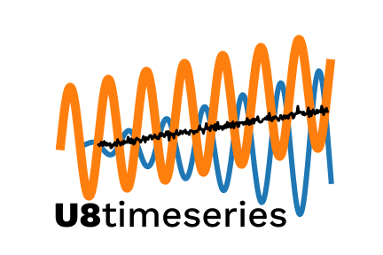
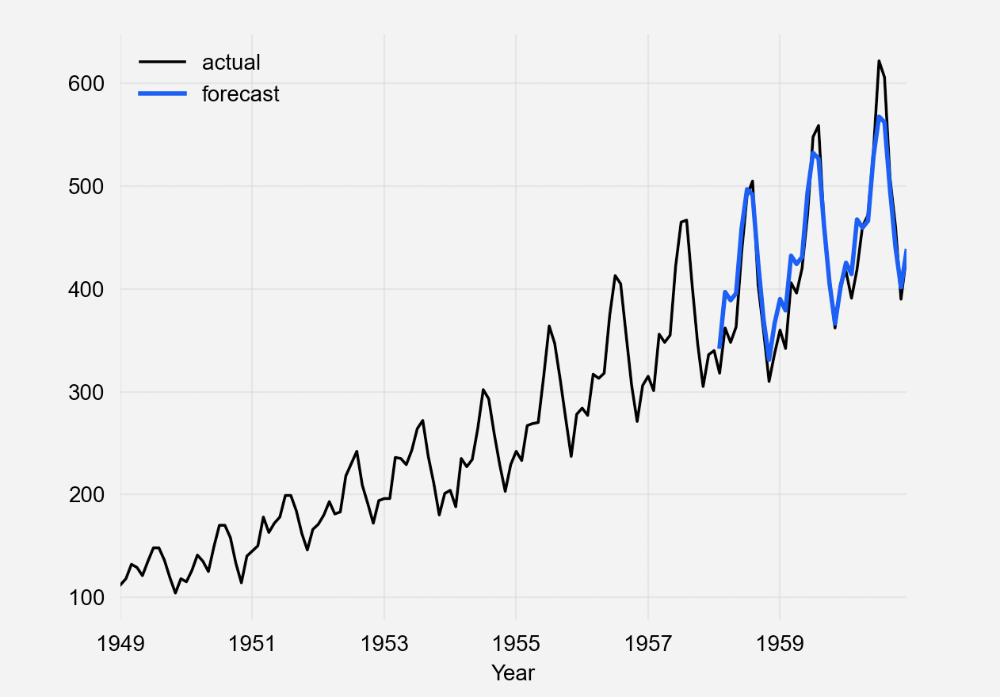

**u8timeseries** is a python library for easy manipulation and forecasting time series in python.
It contains a variety of models, from classics such as ARIMA to neural networks.
The models can all be used in the same way, using `fit()` and `predict()` functions,
similar to scikit-learn. The library also makes it easy to backtest models,
and combine the predictions of several models and external regressors.

# Install

From your favorite Python environment (3.6+), you can run:
```
pip install u8timeseries
```

#### Running the examples only, without installing:

To run the example notebooks without installing, using Docker, you can also run: 
```
cd scripts
./build_docker.sh && ./run_docker.sh
```
Then copy and paste the URL provided by the docker container into your browser to access Jupyter notebook.
This requires a Docker install.


# Example Usage
Create `TimeSeries` object from a Pandas DataFrame, and split in train/validation series:
```python
from u8timeseries import TimeSeries

df = pd.read_csv('AirPassengers.csv', delimiter=",")
series = TimeSeries.from_dataframe(df, 'Month', '#Passengers')
train, val = series.split_after(pd.Timestamp('19590101'))
```

Fit an exponential smoothing model, and make a prediction over the validation series' duration:
```python
from u8timeseries import ExponentialSmoothing

model = ExponentialSmoothing()
model.fit(train)
prediction = model.predict(len(val))
```

Plot:
```python
series.plot(label='actual', lw=3)
prediction.plot(label='forecast', lw=3)
plt.legend()
plt.xlabel('Year')
```


We invite you to go over the example notebooks in the `examples` directory.

# Documentation
The documentation of the API and models is available [here](https://unit8co.github.io/u8timeseries/).

# Features
Currently, the library contains the following features: 

**Forecasting Models:** 
* Exponential smoothing, 
* ARIMA & auto-ARIMA,
* Facebook Prophet,
* Theta method,
* FFT (Fast Fourier Transform)
* Recurrent neural networks (vanilla RNNs, GRU, and LSTM variants).

**Preprocessing:** Transformer tool for easily scaling / normalizing time series.

**Metrics:** A variety of metrics for evaluating time series' goodness of fit; 
from R2-scores to Mean Absolute Scaled Error.

**Backtesting:** Utilities for simulating historical forecasts, using moving time windows.

**Regressive Models:** Possibility to predict a time series from several other time series 
(e.g., external regressors), using arbitrary regressive models.


# Contribute
The development is ongoing, and there are many new features that we want to add. 
We welcome pull requests and issues on github.
