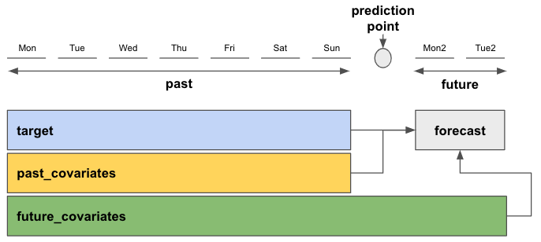

# Covariates
Sections about past and future covariates were written for darts version 0.15.0 and later.
Sections about static covariates were written for darts version 0.20.0 and later.

## Summary - TL;DR
In Darts, **covariates** refer to external data that can be used as inputs to models to help improve forecasts.
In the context of forecasting models, the **target** is the series to be forecasted/predicted, and the
covariates themselves are not predicted. We distinguish three kinds of covariates:

* **past covariates** are (by definition) covariates known only into the past (e.g. measurements)
* **future covariates** are (by definition) covariates known into the future (e.g., weather forecasts)
* **static covariates** are (by definition) covariates constant over time (e.g., product IDs). Check out our static covariates example notebook [here](https://unit8co.github.io/darts/examples/15-static-covariates.html) for more information.

Models in Darts accept `past_covariates` and/or `future_covariates` in their `fit()` and `predict()` methods, depending on their capabilities (some models accept no covariates at all). Both target and covariates must be a `TimeSeries` object. The models will raise an error if covariates were used that are not supported.
```python
# create one of Darts' forecasting models
model = SomeForecastingModel(...)

# fitting model with past and future covariates
model.fit(target=target,
          past_covariates=past_covariates_train,
          future_covariates=future_covariates_train)

# predict the next n=12 steps
model.predict(n=12,
              series=target,  # only required for Global Forecasting Models
              past_covariates=past_covariates_pred,
              future_covariates=future_covariates_pred)
```
Different to past and future covariates, static covariates must be embedded in the **target** series. Because of that, working with static covariates follows a different methodology. You can check out how to use static covariates in [this example](https://unit8co.github.io/darts/examples/15-static-covariates.html).

If you have several covariate variables that you want to use as past (or future) covariates, you have to `stack()` all of them into a single `past_covariates` (or `future_covariates`) object.

```python
# stack two TimeSeries with stack()
past_covariates = past_covariates.stack(other_past_covariates)

# or with concatenate()
from darts import concatenate
past_covariates = concatenate([past_covariates, other_past_covariates], axis=1)
```

Darts' forecasting models expect one past and/or future covariate series per target series. If you use multiple target series with one of Darts' Global Forecasting Models, you must supply the same number of dedicated covariates to `fit()`.

```python
# fit using multiple (two) target series
model.fit(target=[target, target_2],
          past_covariates=[past_covariates, past_covariates_2],
          # optional future_covariates,
          )

# you must give the specific target and covariate series that you want to predict
model.predict(n=12,
              series=target_2,
              past_covariates=past_covariates_2,
              # optional future_covariates,
              )
```

If you train a model using `past_covariates`, you'll have to provide these `past_covariates` also at prediction time to `predict()`. This applies to `future_covariates` too, with a nuance that `future_covariates` have to extend far enough into the future at prediction time (all the way to the forecast horizon `n`). This can be seen in the graph below. `past_covariates` needs to include at least the same time steps as `target`, and `future_covariates` must include at least the same time span plus additional `n` forecast horizon time steps.

**You can use the same `*_covariates` for both training and prediction, given that they contain the required time spans.**



**Figure 1: Top level summary of how forecasting models work with target and covariates for a prediction with forecast horizon n=2**

There are some extra nuances that might be good to know. For instance, deep learning models in Darts
can (in general) forecast `output_chunk_length` points at a time. However it is still possible for models
trained with past covariates to make forecasts for some horizon `n > output_chunk_length` if the `past_covariates`
are known far enough into the future. In such cases, the forecasts are obtained by consuming future values
of the past covariates, and using auto-regression on the target series. If you want to know more details, read on.


## Introduction - What are covariates (in Darts)?
Past, future and static covariates provide additional information/context that can be useful to improve the prediction of the `target` series. The `target` series is the variable we wish to predict the future for. We do not predict the covariates themselves, only use them for prediction of the `target`.

Past and future covariates hold information about the past (up to and including present time) or future. This is always relative to the prediction point (in time) after which we want to forecast the future.
In Darts, we refer to these two types as `past_covariates` and `future_covariates`.

Static covariates hold time independent (constant / static) information about the `target` series. We refer to them as `static_covariates`. They must be embedded in the `target` series. Working with static covariates follows a slightly different approach than with past or future covariates. Check out our [notebook on static covariates](https://unit8co.github.io/darts/examples/15-static-covariates.html) to learn more.

Darts' forecasting models have different support modes for `*_covariates`. Some do not support covariates at all, others support only past or future covariates and some even support all three (more on that in [this subsection](#forecasting-model-covariate-support)).

Let's have a look at some examples of past, future, and static covariates:
- `past_covariates`: typically measurements (past data) or temporal attributes
    -   daily average **measured** temperatures (known only in the past)
    -   day of week, month, year, ...
- `future_covariates`: typically forecasts (future known data) or temporal attributes
    -   daily average **forecasted** temperatures (known in the future)
    -   day of week, month, year, ...
- `static_covariates`: time independent/constant/static `target` characteristics
    -   categorical:
        - location of `target` (country, city, .. name)
        - `target` identifier: (product ID, store ID, ...)
    -   numerical:
        - population of `target`'s country/market area (assuming it stays constant over the forecasting horizon)
        - average temperature of `target`'s region (assuming it stays constant over the forecasting horizon)


Temporal attributes are powerful because they are known in advance and can help models capture trends and / or seasonal patterns of the `target` series.
Static attributes are powerful when working with multiple `targets` (either multiple `TimeSeries`, or multivariate series containing multiple dimensions each). The time independent information can help models identify the nature/environment of the underlying series and improve forecasts across different `targets`.

In this guide we'll focus on past and future covariates. Here's a simple rule-of-thumb to know if your series are **past** or **future covariates**:

*If the values are known in advance, they are future covariates (or can be used as past covariates). If they are not, they **must** be past covariates.*

You might imagine cases where you want to train a model supporting only `past_covariates` (such as `TCNModel`, see Table 1). In this case, you could use for instance say, the **forecasted** temperature as a past covariate for the model *even though you also have access to temperature forecasts in the future*. Knowing such "future values of past covariates" can allow you to make forecasts further into the future (for Darts' deep learning models with forecast horizons `n > output_chunk_length`). Similarly most models consuming future covariates can also use "historic values of future covariates".

Side note: if you don't have future values (e.g. of measured temperatures), nothing prevents you from applying one of Darts' forecasting models to forecast future temperatures, and then use this as `future_covariates`. Darts is not attempting to forecast the covariates for you, as this would introduce an extra "hidden" modeling step, which we think is best left to the users.


## Forecasting Model Covariate Support
Darts' forecasting models accept optional `past_covariates` and / or `future_covariates` in their `fit()` and `predict()` methods (and `static_covariates` embedded in the `target` series), depending on their capabilities. Table 1 shows the supported covariate types for each model. The models will raise an error if covariates were used that are not supported.

### Local Forecasting Models (LFMs):
LFMs are models that can be trained on a single target series only. In Darts most models in this category tend to be simpler statistical models (such as ETS or ARIMA). LFMs accept only a single `target` (and covariate) time series and usually train on the entire series you supplied when calling `fit()` at once. They can also predict in one go for any number of predictions `n` after the end of the training series.

### Global Forecasting Models (GFMs)
GFMs are models that can be trained on multiple target (and covariate) time series. Different to LFMs, the GFMs train and predict on fixed-length sub-samples (chunks) of the input data. In Darts, these are the global (naive) baseline models, regression models, PyTorch (Lightning)-based models (neural networks), as well ensemble models (depending on their ensemble model and / or the forecasting models they ensemble).

----

| Model                                                                                                                                                                                                                                                                                     | Past Covariates | Future Covariates | Static Covariates |
|-------------------------------------------------------------------------------------------------------------------------------------------------------------------------------------------------------------------------------------------------------------------------------------------|-----------------|:-----------------:|:-----------------:|
| **Local Forecasting Models (LFMs)**                                                                                                                                                                                                                                                       |                 |                   |                   |
| Naive Baselines (a)                                                                                                                                                                                                                                                                       |                 |                   |                   |
| [ARIMA](https://unit8co.github.io/darts/generated_api/darts.models.forecasting.arima.html#darts.models.forecasting.arima.ARIMA)                                                                                                                                                           |                 |         ✅         |                   |
| [VARIMA](https://unit8co.github.io/darts/generated_api/darts.models.forecasting.varima.html#darts.models.forecasting.varima.VARIMA)                                                                                                                                                       |                 |         ✅         |                   |
| [AutoARIMA](https://unit8co.github.io/darts/generated_api/darts.models.forecasting.sf_auto_arima.html#darts.models.forecasting.sf_auto_arima.AutoARIMA)                                                                                                         |                 |         ✅         |                   |
| [ExponentialSmoothing](https://unit8co.github.io/darts/generated_api/darts.models.forecasting.exponential_smoothing.html#darts.models.forecasting.exponential_smoothing.ExponentialSmoothing)                                                                                             |                 |                   |                   |
| [AutoETS](https://unit8co.github.io/darts/generated_api/darts.models.forecasting.sf_auto_ets.html#darts.models.forecasting.sf_auto_ets.AutoETS)                                                                                                                 |                 |         ✅         |                   |
| [AutoCES](https://unit8co.github.io/darts/generated_api/darts.models.forecasting.sf_auto_ces.html#darts.models.forecasting.sf_auto_ces.AutoCES)                                                                                                                 |                 |                   |                   |
| [AutoMFLES](https://unit8co.github.io/darts/generated_api/darts.models.forecasting.sf_auto_mfles.html#darts.models.forecasting.sf_auto_mfles.AutoMFLES)                                                                                                         |                 |         ✅         |                   |
| [BATS](https://unit8co.github.io/darts/generated_api/darts.models.forecasting.tbats_model.html#darts.models.forecasting.tbats_model.BATS) and [TBATS](https://unit8co.github.io/darts/generated_api/darts.models.forecasting.tbats_model.html#darts.models.forecasting.tbats_model.TBATS) |                 |                   |                   |
| [AutoTBATS](https://unit8co.github.io/darts/generated_api/darts.models.forecasting.sf_auto_tbats.html#darts.models.forecasting.sf_auto_tbats.AutoTBATS)                                                                                                         |                 |                   |                   |
| [Theta](https://unit8co.github.io/darts/generated_api/darts.models.forecasting.theta.html#darts.models.forecasting.theta.Theta) and [FourTheta](https://unit8co.github.io/darts/generated_api/darts.models.forecasting.theta.html#darts.models.forecasting.theta.FourTheta)               |                 |                   |                   |
| [AutoTheta](https://unit8co.github.io/darts/generated_api/darts.models.forecasting.sf_auto_theta.html#darts.models.forecasting.sf_auto_theta.AutoTheta)                                                                                                         |                 |                   |                   |
| [Prophet](https://unit8co.github.io/darts/generated_api/darts.models.forecasting.prophet_model.html#darts.models.forecasting.prophet_model.Prophet)                                                                                                                                       |                 |         ✅         |                   |
| [FFT](https://unit8co.github.io/darts/generated_api/darts.models.forecasting.fft.html#darts.models.forecasting.fft.FFT) (Fast Fourier Transform)                                                                                                                                          |                 |                   |                   |
| [KalmanForecaster](https://unit8co.github.io/darts/generated_api/darts.models.forecasting.kalman_forecaster.html#darts.models.forecasting.kalman_forecaster.KalmanForecaster)                                                                                                             |                 |         ✅         |                   |
| [Croston](https://unit8co.github.io/darts/generated_api/darts.models.forecasting.croston.html#darts.models.forecasting.croston.Croston) method                                                                                                                                            |                 |                   |                   |
| **Global Forecasting Models (GFMs)**                                                                                                                                                                                                                                                      |                 |                   |                   |
| Global Naive Baselines (b)                                                                                                                                                                                                                                                                |                 |                   |                   |
| Regression Models (c)                                                                                                                                                                                                                                                                     | ✅               |         ✅         |         ✅         |
| [RNNModel](https://unit8co.github.io/darts/generated_api/darts.models.forecasting.rnn_model.html#darts.models.forecasting.rnn_model.RNNModel) (d)                                                                                                                                         |                 |         ✅         |                   |
| [BlockRNNModel](https://unit8co.github.io/darts/generated_api/darts.models.forecasting.block_rnn_model.html#darts.models.forecasting.block_rnn_model.BlockRNNModel) (e)                                                                                                                   | ✅               |                   |                   |
| [NBEATSModel](https://unit8co.github.io/darts/generated_api/darts.models.forecasting.nbeats.html#darts.models.forecasting.nbeats.NBEATSModel)                                                                                                                                             | ✅               |                   |                   |
| [NHiTSModel](https://unit8co.github.io/darts/generated_api/darts.models.forecasting.nhits.html#darts.models.forecasting.nhits.NHiTSModel)                                                                                                                                                 | ✅               |                   |                   |
| [TCNModel](https://unit8co.github.io/darts/generated_api/darts.models.forecasting.tcn_model.html#darts.models.forecasting.tcn_model.TCNModel)                                                                                                                                             | ✅               |                   |                   |
| [TransformerModel](https://unit8co.github.io/darts/generated_api/darts.models.forecasting.transformer_model.html#darts.models.forecasting.transformer_model.TransformerModel)                                                                                                             | ✅               |                   |                   |
| [TFTModel](https://unit8co.github.io/darts/generated_api/darts.models.forecasting.tft_model.html#darts.models.forecasting.tft_model.TFTModel)                                                                                                                                             | ✅               |         ✅         |         ✅         |
| [DLinearModel](https://unit8co.github.io/darts/generated_api/darts.models.forecasting.dlinear.html#darts.models.forecasting.dlinear.DLinearModel)                                                                                                                                         | ✅               |         ✅         |         ✅         |
| [NLinearModel](https://unit8co.github.io/darts/generated_api/darts.models.forecasting.nlinear.html#darts.models.forecasting.nlinear.NLinearModel)                                                                                                                                         | ✅               |         ✅         |         ✅         |
| [TiDEModel](https://unit8co.github.io/darts/generated_api/darts.models.forecasting.tide_model.html#darts.models.forecasting.tide_model.TiDEModel)                                                                                                                                         | ✅               |         ✅         |         ✅         |
| [TSMixerModel](https://unit8co.github.io/darts/generated_api/darts.models.forecasting.tsmixer_model.html#darts.models.forecasting.tsmixer_model.TSMixerModel)                                                                                                                             | ✅               |         ✅         |         ✅         |
| Ensemble Models (f)                                                                                                                                                                                                                                                                       | ✅               |         ✅         |         ✅         |
| Conformal Prediction Models (g)                                                                                                                                                                                                                                                           | ✅               |         ✅         |         ✅         |

**Table 1: Darts' forecasting models and their covariate support**


(a) Naive Baselines including [NaiveDrift](https://unit8co.github.io/darts/generated_api/darts.models.forecasting.baselines.html#darts.models.forecasting.baselines.NaiveDrift), [NaiveMean](https://unit8co.github.io/darts/generated_api/darts.models.forecasting.baselines.html#darts.models.forecasting.baselines.NaiveMean), [NaiveMovingAverage](https://unit8co.github.io/darts/generated_api/darts.models.forecasting.baselines.html#darts.models.forecasting.baselines.NaiveMovingAverage), and [NaiveSeasonal](https://unit8co.github.io/darts/generated_api/darts.models.forecasting.baselines.html#darts.models.forecasting.baselines.NaiveSeasonal).

(b) Global Naive Baselines including [GlobalNaiveAggregate](https://unit8co.github.io/darts/generated_api/darts.models.forecasting.global_baseline_models.html#darts.models.forecasting.global_baseline_models.GlobalNaiveAggregate), [GlobalNaiveDrift](https://unit8co.github.io/darts/generated_api/darts.models.forecasting.global_baseline_models.html#darts.models.forecasting.global_baseline_models.GlobalNaiveDrift), and [GlobalNaiveSeasonal](https://unit8co.github.io/darts/generated_api/darts.models.forecasting.global_baseline_models.html#darts.models.forecasting.global_baseline_models.GlobalNaiveSeasonal).

(c) Regression Models including [RegressionModel](https://unit8co.github.io/darts/generated_api/darts.models.forecasting.regression_model.html#regression-model), [LinearRegressionModel](https://unit8co.github.io/darts/generated_api/darts.models.forecasting.linear_regression_model.html#darts.models.forecasting.linear_regression_model.LinearRegressionModel), [RandomForest](https://unit8co.github.io/darts/generated_api/darts.models.forecasting.random_forest.html#darts.models.forecasting.random_forest.RandomForest), [LightGBMModel](https://unit8co.github.io/darts/generated_api/darts.models.forecasting.lgbm.html#darts.models.forecasting.lgbm.LightGBMModel), [XGBModel](https://unit8co.github.io/darts/generated_api/darts.models.forecasting.xgboost.html#darts.models.forecasting.xgboost.XGBModel), and [CatBoostModel](https://unit8co.github.io/darts/generated_api/darts.models.forecasting.catboost_model.html#darts.models.forecasting.catboost_model.CatBoostModel). RegressionModel is a special kind of GFM which can use arbitrary lags on covariates (past and/or future) and past targets to do predictions.

(d) [RNNModel](https://unit8co.github.io/darts/generated_api/darts.models.forecasting.rnn_model.html#darts.models.forecasting.rnn_model.RNNModel) including `LSTM` and `GRU`; equivalent to DeepAR in its probabilistic version

(e) [BlockRNNModel](https://unit8co.github.io/darts/generated_api/darts.models.forecasting.block_rnn_model.html#darts.models.forecasting.block_rnn_model.BlockRNNModel) including `LSTM` and `GRU`

(f) Ensemble Model including [RegressionEnsembleModel](https://unit8co.github.io/darts/generated_api/darts.models.forecasting.regression_ensemble_model.html#darts.models.forecasting.regression_ensemble_model.RegressionEnsembleModel), and [NaiveEnsembleModel](https://unit8co.github.io/darts/generated_api/darts.models.forecasting.baselines.html#darts.models.forecasting.baselines.NaiveEnsembleModel). The covariate support is given by the covariate support of the ensembled forecasting models.

(g) Conformal Prediction Model including [ConformalNaiveModel](https://unit8co.github.io/darts/generated_api/darts.models.forecasting.conformal_models.html#darts.models.forecasting.conformal_models.ConformalNaiveModel), and [ConformalQRModel](https://unit8co.github.io/darts/generated_api/darts.models.forecasting.conformal_models.html#darts.models.forecasting.conformal_models.ConformalQRModel). The covariate support is given by the covariate support of the underlying forecasting model.

----

## Quick guide on how to use past and/or future covariates with Darts' forecasting models
It is very simple to use covariates with Darts' forecasting models. There are just some requirements they have to fulfill.

Just like the `target` series, each of your past and / or future covariates series must be a `TimeSeries` object. When you train your model with `fit()` using past and /or future covariates, you have to supply the same types of covariates to `predict()`. Depending on the choice of your model and how long your forecast horizon `n` is, there might be different time span requirements for your covariates. You can find these requirements in the [next subsection](#covariate-time-span-requirements-for-local-and-global-forecasting-models).

**You can even use the same `*_covariates` for fitting and prediction if they contain the required time spans. This is because Darts will "intelligently" slice them for you based on the target time axis.**

```python
# create one of Darts' forecasting model
model = SomeForecastingModel(...)

# fit the model
model.fit(target,
          past_covariates=past_covariate,
          future_covariates=future_covariates)

# make a prediction with the same covariate types
pred = model.predict(n=1,
                     series=target,  # this is only required for GFMs
                     past_covariates=past_covariates,
                     future_covariates=future_covariates)
```

To use multiple past and / or future covariates with your `target`, you have to stack them all together into a single dedicated `TimeSeries`:

```python
# stack() time series
past_covariates = past_covariates.stack(past_covariates2)

# or concatenate()
from darts import concatenate
past_covariates = concatenate([past_covariates, past_covariates2, ...], axis=1)
```

GFMs can be trained on multiple `target` series. You have to supply one covariate TimeSeries per `target` TimeSeries you use with `fit()`. At prediction time you have to specify which `target` series you want to predict and supply the corresponding covariates:
```python
from darts.models import NBEATSModel

# multiple time series
all_targets = [target1, target2, ...]
all_past_covariates = [past_covariates1, past_covariates2, ...]

# create a GFM model, train and predict
model = NBEATSModel(input_chunk_length=1, output_chunk_length=1)

model.fit(all_targets,
          past_covariates=all_past_covariates)

pred = model.predict(n=1,
                     series=all_targets[0],
                     past_covariates=all_past_covariates[0])
```

## Covariate time span requirements for Local and Global Forecasting Models

There are differences in how Darts' "Local" and "Global" Forecasting Models perform training and prediction. Specifically, how they extract/work with the data supplied during fit() and predict().

Depending on the model you use and how long your forecast horizon `n` is, there might be different time span requirements for your covariates.

### Local Forecasting Models (LFMs):
LFMs usually train on the entire `target` and `future_covariates` series (if supported) you supplied when calling `fit()` at once. They can also predict in one go for forecast horizon `n` after the end of the `target`.

*Time span requirements to use the same future covariates series for both `fit()` and `predict()`:*
- `future_covariates`: **at least** the same time span as `target` plus the next `n` time steps after the end of `target`


### Global Forecasting Models (GFMs):
GFMs train and predict on fixed-length chunks (sub-samples) of the `target` and `*_covariates` series (if supported). Each chunk contains an input chunk - representing the sample's past - and an output chunk - the sample's future. The length of these chunks has to be specified at model creation with parameters `input_chunk_length` and `output_chunk_length` (one notable exception is `RNNModel` which always uses an `output_chunk_length` of 1).

Depending on your forecast horizon `n`, the model can either predict in one go, or auto-regressively, by predicting on multiple chunks in the future. That is the reason why when predicting with `past_covariates` you have to supply additional "future values of your `past_covariates`".

**Time span requirements to use the same past and / or future covariates series for both `fit()` and `predict()`:**

- with `n <= output_chunk_length`:
  - `past_covariates`: **at least** the same time span as `target`
  - `future_covariates`: **at least** the same time span as `target` plus the next `output_chunk_length` time steps after the end of `target`
- with `n > output_chunk_length`:
  - `past_covariates`: **at least** the same time span as `target` plus the next `n - output_chunk_length` time steps after the end of `target`
  - `future_covariates`: **at least** the same time span as `target` plus the next `n` time steps after the end of `target`

If you want to know more details about how covariates are used behind the scenes in Global Forecasting Models, read our [guide on Torch Forecasting Models](https://unit8co.github.io/darts/userguide/torch_forecasting_models.html) (PyTorch based GFMs). It gives a step-by-step explanation of the training and prediction process using one of our Torch Forecasting Models.

## Examples
Here are a few examples showcasing how to use covariates with Darts forecasting models:

- [Static covariates tutorial including TFTModel example](https://unit8co.github.io/darts/examples/15-static-covariates.html)
- [Past covariates with GFMs](https://unit8co.github.io/darts/examples/01-multi-time-series-and-covariates.html#Covariates-Series)
- [Past and future covariates with TFTModel](https://unit8co.github.io/darts/examples/13-TFT-examples.html#Training)
- [Past and future covariates with RegressionModels](https://medium.com/unit8-machine-learning-publication/time-series-forecasting-using-past-and-future-external-data-with-darts-1f0539585993)
