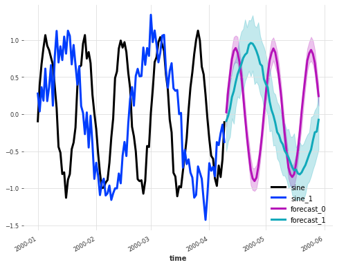
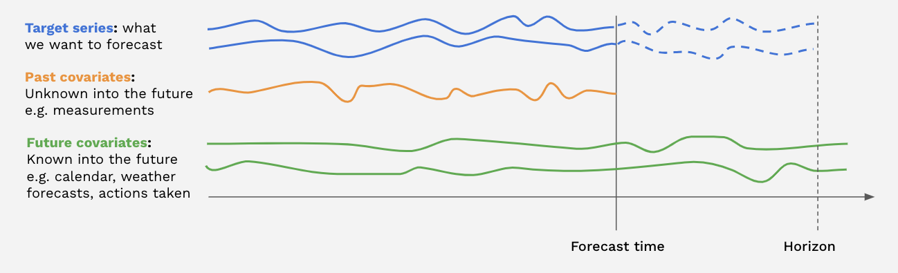
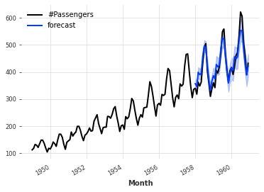
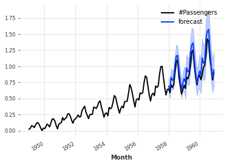
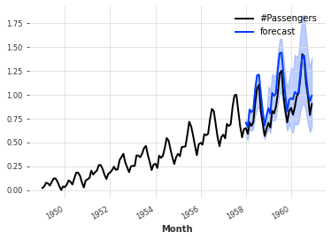
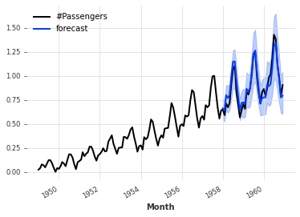
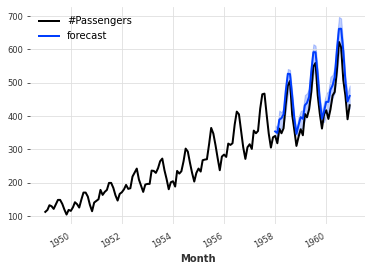

# Overview of Forecasting Models

Forecasting models are models that can produce predictions about future values of some time series, given the history of this series.
The forecasting models in Darts are [listed on the README](https://github.com/unit8co/darts#forecasting-models). They have different capabilities and features. For example, some models work on multidimensional series, return probabilistic forecasts, or accept other kinds of external *covariates* data in input.

Below, we give an overview of what these features mean.

## Generalities

All forecasting models work in the same way: first they are built (taking some hyper-parameters in argument), then they are fit on one or several series
by calling the `fit()` function, and finally they are used to obtain one or several forecasts by calling the `predict()` function.

**Example:**
```python
from darts.models import NaiveSeasonal

naive_model = NaiveSeasonal(K=1)            # init
naive_model.fit(train)                      # fit
naive_forecast = naive_model.predict(n=36)  # predict
```

The argument `n` of `predict()` indicates the number of time stamps to predict.
When `fit()` is provided with only one training `TimeSeries`, this series is stored, and `predict()` will return forecasts for this series.
On the other hand, some models support calling `fit()` on multiple time series (a `Sequence[TimeSeries]`). In such cases, one or several series must
be provided to `predict()`, and the model will produce forecasts for this/these time series.

**Example:**
```python
from darts.models import NBEATSModel

model = NBEATSModel(input_chunk_length=24,                 # init
                    output_chunk_length=12)

model.fit([series1, series2])                              # fit on two series
forecast = model.predict(series=[series3, series4], n=36)  # predict potentially different series
```

Furthermore, we define the following types of time series consumed by the models:

* **Target series:** the series that we are interested in forecasting.
* **Covariate series:** some other series that we are not interested in forecasting, but that can provide valuable inputs to the forecasting model.

## Saving and Loading Models

If you wish to save a particular model and use it elsewhere or at a later point in time, darts can achieve that. It leverages pickle and in the case of Torch models relies on saving PyTorch Lightning trainer checkpoints.
All forecasting models support saving the model on the filesystem, by calling the `save()` function, which saves that particular `ForecastingModel` object instance. When the model is to be used again, the method `load()` can be used. Please note that the methods `save_model()` and `load_model()` are deprecated.

**Example:**
```python
from darts.models import RegressionModel

model = RegressionModel(lags=4)

model.save("my_model.pkl")
model_loaded = RegressionModel.load("my_model.pkl")
```

The parameter `path` specifies a path or file handle under which to save the model at its current state. If no `path` is specified, the model is automatically
saved under ``"{ModelClass}_{YYYY-mm-dd_HH:MM:SS}.pkl"``. E.g., ``"RegressionModel_2020-01-01_12:00:00.pkl"``.
Optionally there is also pickle specific keyword arguments `protocol`, `fix_imports` and `buffer_callback`.
More info: [pickle.dump()](https://docs.python.org/3/library/pickle.html?highlight=dump#pickle.dump)

With torch models, the model parameters and the training state are saved. We use the trainer to save the model checkpoint.

**Example:**
```python
from darts.models import NBEATSModel

model = NBEATSModel(input_chunk_length=24,
                    output_chunk_length=12)

model.save("my_model.pt")
model_loaded = NBEATSModel.load("my_model.pt")
```

Private methods for torch models used under the hood:

* **save_checkpoint:** In addition, we need to use PTL save_checkpoint() to properly save the trainer and model. It is used to be able to save a snapshot of the model mid-training, and then be able to retrieve the model later.
* **load_from_checkpoint:** returns a model checkpointed during training (by default the one with lowest validation loss).


## Support for multivariate series

Some models support multivariate time series. This means that the target (and potential covariates) series provided to the model
during fit and predict stage can have multiple dimensions. The model will then in turn produce multivariate forecasts.

Here is an example, using a `KalmanForecaster` to forecast a single multivariate series made of 2 components:
```python
import darts.utils.timeseries_generation as tg
from darts.models import KalmanForecaster
import matplotlib.pyplot as plt

series1 = tg.sine_timeseries(value_frequency=0.05, length=100) + 0.1 * tg.gaussian_timeseries(length=100)
series2 = tg.sine_timeseries(value_frequency=0.02, length=100) + 0.2 * tg.gaussian_timeseries(length=100)

multivariate_series = series1.stack(series2)

model = KalmanForecaster(dim_x=4)
model.fit(multivariate_series)
pred = model.predict(n=50, num_samples=100)

plt.figure(figsize=(8,6))
multivariate_series.plot(lw=3)
pred.plot(lw=3, label='forecast')
```



These models are shown with a "✅" under the `Multivariate` column on the [model list](https://github.com/unit8co/darts#forecasting-models).

## Handling multiple series

Some models support being fit on multiple time series. To do this, it is enough to simply provide a Python `Sequence` of `TimeSeries` (for instance a list of `TimeSeries`) to `fit()`. When a model is fit this way, the `predict()` function will expect the argument `series` to be set, containing
one or several `TimeSeries` (i.e., a single or a `Sequence` of `TimeSeries`) that need to be forecasted.
The advantage of training on multiple series is that a single model can be exposed to more patterns occurring across all series in the training dataset. That can often be beneficial, especially for larger models with more capacity.

In turn, the advantage of having `predict()` providing forecasts for potentially several series at once is that the computation can often be batched and vectorized across the multiple series, which is computationally faster than calling `predict()` multiple times on isolated series.

These models are shown with a "✅" under the `Multiple-series training` column on the [model list](https://github.com/unit8co/darts#forecasting-models).

You can also find out programmatically, whether a model supports multiple series.
```python
from darts.models import RegressionModel
from darts.models.forecasting.forecasting_model import GlobalForecastingModel

# when True, multiple time series are supported
supports_multi_ts = issubclass(RegressionModel, GlobalForecastingModel)
```

[This article](https://medium.com/unit8-machine-learning-publication/training-forecasting-models-on-multiple-time-series-with-darts-dc4be70b1844) provides more explanations about training models on multiple series.

## Support for Covariates

Some models support *covariate series*. Covariate series are time series that the models can take as inputs, but will not forecast.
We distinguish between *past covariates* and *future covariates*:

* Past covariates are covariate time series whose values are **not** known into the future at prediction time. Those can for instance represent signals that have to be measured and are not known upfront. Models do not use the future values of `past_covariates` when making forecasts.
* Future covariates are covariate time series whose values are known into the future at prediction time (up until the forecast horizon). These can represent signals such as calendar information, holidays, weather forecasts, etc. Models that accept `future_covariates` will consume the future values (up to the forecast horizon) when making forecasts.



Past and future covariates can be used by providing respectively `past_covariates` and `future_covariates` arguments to `fit()` and `predict()`.
When a model is trained on multiple target series, one covariate has to be provided per target series. The covariate series themselves can be multivariate
and contain multiple "covariate dimensions"; see the [TimeSeries guide](https://unit8co.github.io/darts/userguide/timeseries.html) for how to build multivariate series.

It is not necessary to worry about the covariates series having the exact right time spans (e.g., so that the last timestamp of future covariates matches the forecast horizon). Darts takes care of slicing the covariates behind the scenes, based on the time axes of the target(s) and that of the covariates.

Models supporting past (resp. future) covariates are indicated with a "✅" under the `Past-observed covariates support` (resp. `Future-known covariates support`) columns on the [model list](https://github.com/unit8co/darts#forecasting-models),

To know more about covariates, please refer to the [covariates section of the user guide](https://unit8co.github.io/darts/userguide/covariates.html).

In addition, you can have a look at [this article](https://medium.com/unit8-machine-learning-publication/time-series-forecasting-using-past-and-future-external-data-with-darts-1f0539585993) for some examples of how to use past and future covariates.

## Probabilistic forecasts

Some of the models in Darts can produce probabilistic forecasts. For these models, the `TimeSeries` returned by `predict()` will be probabilistic, and contain a certain number of Monte Carlo samples describing the joint distribution over time and components. The number of samples can be directly determined by the argument `num_samples` of the `predict()` function (leaving `num_samples=1` will return a deterministic `TimeSeries`).

Models supporting probabilistic forecasts are indicated with a "✅" in the `Probabilistic` column on the [model list](https://github.com/unit8co/darts#forecasting-models).
The actual probabilistic distribution of the forecasts depends on the model.

Some models such as ARIMA, Exponential Smoothing, (T)BATS or KalmanForecaster make normality assumptions and the resulting distribution is a Gaussian with time-dependent parameters. For example:
```python
from darts.datasets import AirPassengersDataset
from darts import TimeSeries
from darts.models import ExponentialSmoothing

series = AirPassengersDataset().load()
train, val = series[:-36], series[-36:]

model = ExponentialSmoothing()
model.fit(train)
pred = model.predict(n=36, num_samples=500)

series.plot()
pred.plot(label='forecast')
```



### Probabilistic neural networks
All neural networks (torch-based models) in Darts have a rich support to estimate different kinds of probability distributions.
When creating the model, it is possible to provide one of the *likelihood models* available in [darts.utils.likelihood_models.torch](https://unit8co.github.io/darts/generated_api/darts.utils.likelihood_models.torch.html), which determine the distribution that will be estimated by the model.
In such cases, the model will output the parameters of the distribution, and it will be trained by minimising the negative log-likelihood of the training samples.
Most of the likelihood models also support prior values for the distribution's parameters, in which case the training loss is regularized by a Kullback-Leibler divergence term pushing the resulting distribution in the direction of the distribution specified by the prior parameters.
The strength of this regularization term can also be specified when creating the likelihood model object.

For example, the code below trains a TCNModel to fit a Laplace distribution. So the neural network outputs 2 parameters (location and scale) of the Laplace distribution. We also specify a prior value of 0.1 on the scale parameter.

```python
from darts.datasets import AirPassengersDataset
from darts import TimeSeries
from darts.models import TCNModel
from darts.dataprocessing.transformers import Scaler
from darts.utils.likelihood_models.torch import LaplaceLikelihood

series = AirPassengersDataset().load()
train, val = series[:-36], series[-36:]

scaler = Scaler()
train = scaler.fit_transform(train)
val = scaler.transform(val)
series = scaler.transform(series)

model = TCNModel(input_chunk_length=30,
                 output_chunk_length=12,
                 likelihood=LaplaceLikelihood(prior_b=0.1))
model.fit(train, epochs=400)
pred = model.predict(n=36, num_samples=500)

series.plot()
pred.plot(label='forecast')
```




It is also possible to perform quantile regression (using arbitrary quantiles) with neural networks, by using [darts.utils.likelihood_models.torch.QuantileRegression](https://unit8co.github.io/darts/generated_api/darts.utils.likelihood_models.torch.html#darts.utils.likelihood_models.torch.QuantileRegression), in which case the network will be trained with the pinball loss. This produces an empirical non-parametric distribution, and it can often be a good option in practice, when one is not sure of the "real" distribution, or when fitting parametric likelihoods give poor results.
For example, the code snippet below is almost exactly the same as the preceding snippet; the only difference is that it now uses a `QuantileRegression` likelihood, which means that the neural network will be trained with a pinball loss, and its number of outputs will be dynamically configured to match the number of quantiles.

```python
from darts.datasets import AirPassengersDataset
from darts import TimeSeries
from darts.models import TCNModel
from darts.dataprocessing.transformers import Scaler
from darts.utils.likelihood_models.torch import QuantileRegression

series = AirPassengersDataset().load()
train, val = series[:-36], series[-36:]

scaler = Scaler()
train = scaler.fit_transform(train)
val = scaler.transform(val)
series = scaler.transform(series)

model = TCNModel(input_chunk_length=30,
                 output_chunk_length=12,
                 likelihood=QuantileRegression(quantiles=[0.01, 0.05, 0.2, 0.5, 0.8, 0.95, 0.99]))
model.fit(train, epochs=400)
pred = model.predict(n=36, num_samples=500)

series.plot()
pred.plot(label='forecast')
```



### Capturing model uncertainty using Monte Carlo Dropout
In Darts, dropout can also be used as an additional way to capture model uncertainty, following the approach described in [1]. This is sometimes referred to as *epistemic uncertainty*, and can be seen as a way to marginalize over a family of models represented by all the different dropout activation functions.

This feature is readily available for all deep learning models integrating some dropout (except RNN models - we refer to the dropout API reference documentations for a mention of models supporting this). It only requires to specify `mc_dropout=True` at prediction time. For example, the code below trains a TCN model (using the default MSE loss) with a dropout rate of 10%, and then produces a probabilistic forecasts using Monte Carlo Dropout:

```python
from darts.datasets import AirPassengersDataset
from darts import TimeSeries
from darts.models import TCNModel
from darts.dataprocessing.transformers import Scaler
from darts.utils.likelihood_models.torch import QuantileRegression

series = AirPassengersDataset().load()
train, val = series[:-36], series[-36:]

scaler = Scaler()
train = scaler.fit_transform(train)
val = scaler.transform(val)
series = scaler.transform(series)

model = TCNModel(input_chunk_length=30,
                 output_chunk_length=12,
                 dropout=0.1)
model.fit(train, epochs=400)
pred = model.predict(n=36, mc_dropout=True, num_samples=500)

series.plot()
pred.plot(label='forecast')
```



Monte Carlo Dropout can be combined with other likelihood estimation in Darts, which can be interpreted as a way to capture both epistemic and aleatoric uncertainty.


### Probabilistic regression models
Some regression models can also be configured to produce probabilistic forecasts too. At the time of writing, [LinearRegressionModel](https://unit8co.github.io/darts/generated_api/darts.models.forecasting.linear_regression_model.html), [LightGBMModel](https://unit8co.github.io/darts/generated_api/darts.models.forecasting.lgbm.html) and [XGBModel](https://unit8co.github.io/darts/generated_api/darts.models.forecasting.xgboost.html) support a `likelihood` argument. When set to `"poisson"` the model will fit a Poisson distribution, and when set to `"quantile"` the model will use the pinball loss to perform quantile regression (the quantiles themselves can be specified using the `quantiles` argument).

Example:
```python
from darts.datasets import AirPassengersDataset
from darts import TimeSeries
from darts.models import LinearRegressionModel

series = AirPassengersDataset().load()
train, val = series[:-36], series[-36:]

model = LinearRegressionModel(lags=30,
                              likelihood="quantile",
                              quantiles=[0.05, 0.1, 0.25, 0.5, 0.75, 0.9, 0.95])
model.fit(train)
pred = model.predict(n=36, num_samples=500)

series.plot()
pred.plot(label='forecast')
```




[1] Yarin Gal, Zoubin Ghahramani, ["Dropout as a Bayesian Approximation: Representing Model Uncertainty in Deep Learning"](https://arxiv.org/abs/1506.02142)
