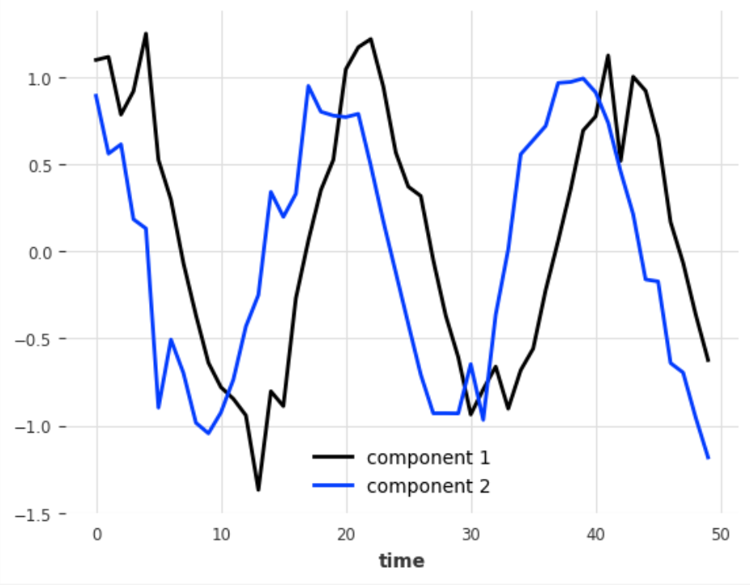
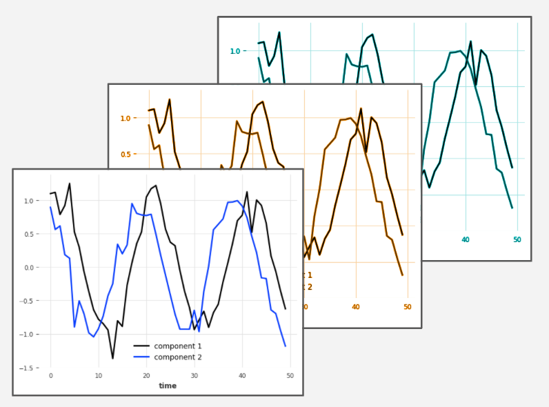

# `TimeSeries`

`TimeSeries` is the main data class in Darts. A `TimeSeries` represents a univariate or multivariate time series, with a proper time index. The time index can either be of type `pandas.DatetimeIndex` (containing datetimes), or of type `pandas.RangeIndex` (containing integers; useful for representing sequential data without specific timestamps). In some cases, `TimeSeries` can even represent *probabilistic* series, in order for instance to obtain confidence intervals.

`TimeSeries` are used in Darts in order to offer a consistent API dedicated to time series:

* `TimeSeries` are guaranteed to have a proper time index (integer or datetime based): complete and time-sorted.
* All models in Darts consume `TimeSeries` and produce `TimeSeries`.
* `TimeSeries` allows to do all sort of time series operations (such as splitting at timestamps, concatenating, etc).
* `TimeSeries` offers user-friendly way to represent multidimensional and probabilistic series (e.g. obtain marginal quantiles).

Using a dedicated type to represent time series (instead of say, Pandas DataFrame, NumPy array, ...) removes the need to rely on conventions about the formats expected by the different models and functions.

## Multivariate time series -vs- multiple time series
We distinguish univariate from multivariate series:

* A **multivariate** series contain multiple dimensions (i.e. multiple values per time step).
* A **univariate** series contains only one dimension (i.e., single scalar value for each time step).

Sometimes the dimensions are called *components*. A single `TimeSeries` object can be either univariate (if it has a single component), or multivariate (if it has multiple components). In a multivariate series, all components share the same time axis. I.e., they all share the same time stamps.

Some models in Darts (and all machine learning models) support multivariate series. This means that they can take multivariate series in inputs (either as targets or as covariates), and the forecasts they produce will have a dimensionality matching that of the targets.

In addition, some models can work on *multiple time series*, meaning that they can be trained on multiple `TimeSeries` objects, and used to forecasts multiple `TimeSeries` objects in one go. This is sometimes referred to as panel data. In such cases, the different `TimeSeries` need not share the same time index -- for instance, some series might be in 1990 and others in 2000. In fact, the series need not even have the same frequency. The models handling multiple series expect Python `Sequence`s of `TimeSeries` in inputs (for example, a simple list of `TimeSeries`).



**Figure 1:** A single multivariate series. In Darts this is represented by a single `TimeSeries` object.



**Figure 2:** Multiple time series. In Darts this is represented by multiple `TimeSeries` objects. The series may or may not share the same time axis, and may or may not be multivariate.

* **Example of a multivariate series:** The blood pressure and heart rate of a single patient over time (one multivariate series with 2 components).

* **Example of multiple series:** The blood pressure and heart rate of multiple patients; potentially measured at different times for different patients (one multivariate series with 2 components per patient).


### Should I use a multivariate series or multiple series for my problem?
Using multivariate series will provide an opportunity for models to capture the dimensions jointly, whereas using multiple series will expose the models to multiple observations. So which representation is right is problem-dependent, and in some cases might not even be clear beforehand and require experimentation. Nevertheless, if you are in a situation where you are trying to model several "correlated" components varying together across time (e.g. the coordinates of a moving object, or multiple measurements related to a single entity), it is often natural to capture those as multiple components in single series. If on the other hand you have several instance of such measurements (e.g., obtained in different experiments or observations), this can mean that you have multiple time series. Furthermore, if your values do not share the same time spans, they should probably be represented as different series.


## Probabilistic and deterministic series
In Darts, probabilistic forecasts are represented by drawing Monte Carlo samples from the underlying probabilistic models. This representation allows `TimeSeries` to represent arbitrary joint distributions (over time and components) without relying on any pre-defined parametric form. Based on this, we define two types of time series:

* A **Probabilistic** (or **stochastic**) series contains multiple samples.
* A **deterministic** series contains only one sample.


## Creating `TimeSeries`
`TimeSeries` objects can be created using factory methods, for example:

* [TimeSeries.from_dataframe()](https://unit8co.github.io/darts/generated_api/darts.timeseries.html#darts.timeseries.TimeSeries.from_dataframe) can create `TimeSeries` from a Pandas Dataframe having one or several columns representing values (columns correspond to components, and several columns would correspond to a multivariate series).

* [TimeSeries.from_values()](https://unit8co.github.io/darts/generated_api/darts.timeseries.html#darts.timeseries.TimeSeries.from_values) can create `TimeSeries` from a 1-D, 2-D or 3-D NumPy array. It will generate an integer-based time index (of type `pandas.RangeIndex`). 1-D corresponds to univariate deterministic series, 2-D to multivariate deterministic series, and 3-D to multivariate stochastic series.

* [TimeSeries.from_times_and_values()](https://unit8co.github.io/darts/generated_api/darts.timeseries.html#darts.timeseries.TimeSeries.from_times_and_values) is similar to `TimeSeries.from_values()` but also accepts a time index.

More methods are documented in the [TimeSeries API documentation](https://unit8co.github.io/darts/generated_api/darts.timeseries.html).

Furthermore, it is possible to concatenate series along different axes using the function `concatenate()`. `axis=0` corresponds to time, `axis=1` corresponds to component and `axis=2` correspond to stochastic sample dimensions. For instance:
```python
from darts import concatenate

my_multivariate_series = concatenate([series1, series2, ...], axis=1)
```
produces a multivariate series from some series that share the same time axis.

## Implementation
Behind the scenes, `TimeSeries` is wrapping around a 3-dimensional `xarray.DataArray` object. The dimensions are *(time, component, sample)*, where the size of the *component* dimension is larger than 1 for multivariate series and the size of the *sample* dimension is larger than 1 for stochastic series. The `DataArray` is itself backed by a 3-dimensional NumPy array, and it has a time index (either `pandas.DatetimeIndex` or `pandas.RangeIndex`) on the *time* dimension and another `pandas.Index` on the *component* (or "columns") dimension. `TimeSeries` is intended to be immutable and most operations return new `TimeSeries` objects.

## Exporting data from a `TimeSeries`
`TimeSeries` objects offer a few ways to export the data, for example:

* [TimeSeries.to_dataframe()](https://unit8co.github.io/darts/generated_api/darts.timeseries.html#darts.timeseries.TimeSeries.pd_dataframe) to export a Dataframe (for deterministic series)

* [TimeSeries.data_array()](https://unit8co.github.io/darts/generated_api/darts.timeseries.html#darts.timeseries.TimeSeries.data_array) to export the `xarray` `DataArray` holding this series' data (and indexes).

* [TimeSeries.values()](https://unit8co.github.io/darts/generated_api/darts.timeseries.html#darts.timeseries.TimeSeries.values) to export a NumPy array containing the values of one sample from the series.

* [TimeSeries.all_values()](https://unit8co.github.io/darts/generated_api/darts.timeseries.html#darts.timeseries.TimeSeries.all_values) to export a NumPy array containing the values of all samples of a stochastic series.


## Static Covariates
Optionally, `TimeSeries` objects can contain static data (referred to as *static covariates*), which can be exploited by some models. Example of static covariates can be:

* Store location - for instance for each store (component) in a multivariate series
* Product ID
* Sensor type
* ...

The static covariates have to be specified by a pandas DataFrame whose rows match the `TimeSeries`'s components, and whose columns represent the dimensions of the static covariates. They can be added to a `TimeSeries` when using most factory methods, using the `static_covariates` parameter. They can also be added to an existing `TimeSeries` using the `with_static_covariates()` method.


## Hierarchical Time Series
Optionally, `TimeSeries` objects can contain a hierarchy, which specifies how its different components are grouped together. The hierarchy itself is specified as a Python dictionary, mapping the components' names to a list of names of their parent(s) in the hierarchy.

For instance, the following hierarchy means that the two components `"a"` and `"b"` add up to `"total"`:
```python
hierarchy = {"a": ["total"], "b": ["total"]}
```

Hierarchies can be used for posthoc forecast reconciliation. Darts offers several reconciliation transformers (usable with `fit()`/`transform()`) - see the [corresponding API documentation](https://unit8co.github.io/darts/generated_api/darts.dataprocessing.transformers.reconciliation.html).


## More information and documentation
The full list of attributes and methods of the `TimeSeries` class is listed in the [API Documentation](https://unit8co.github.io/darts/generated_api/darts.timeseries.html). In addition, the [Quickstart](https://unit8co.github.io/darts/quickstart/00-quickstart.html#Building-and-manipulating-TimeSeries) contains some examples of `TimeSeries` manipulation.
