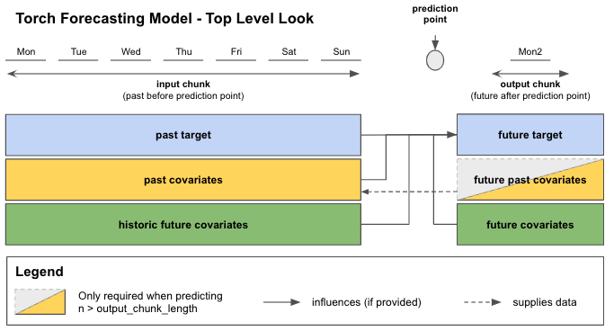
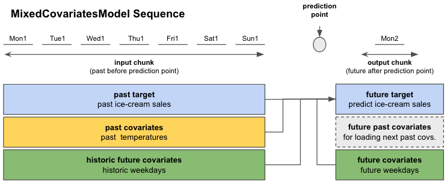
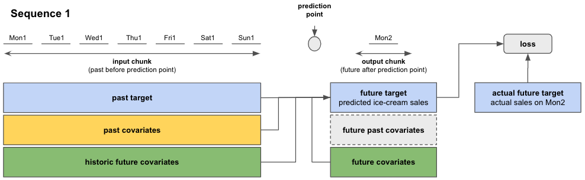
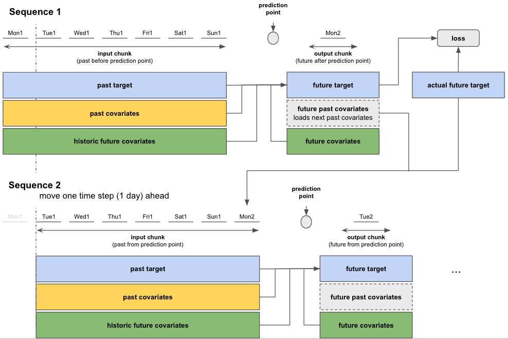
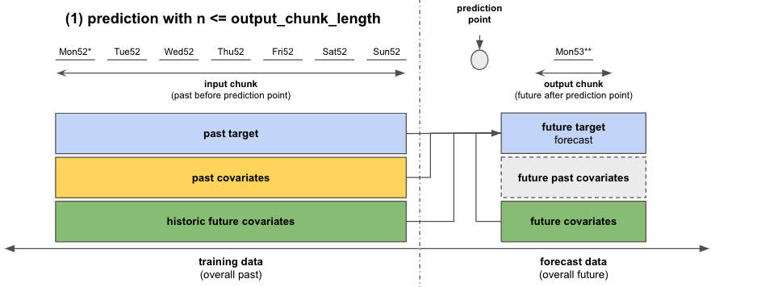
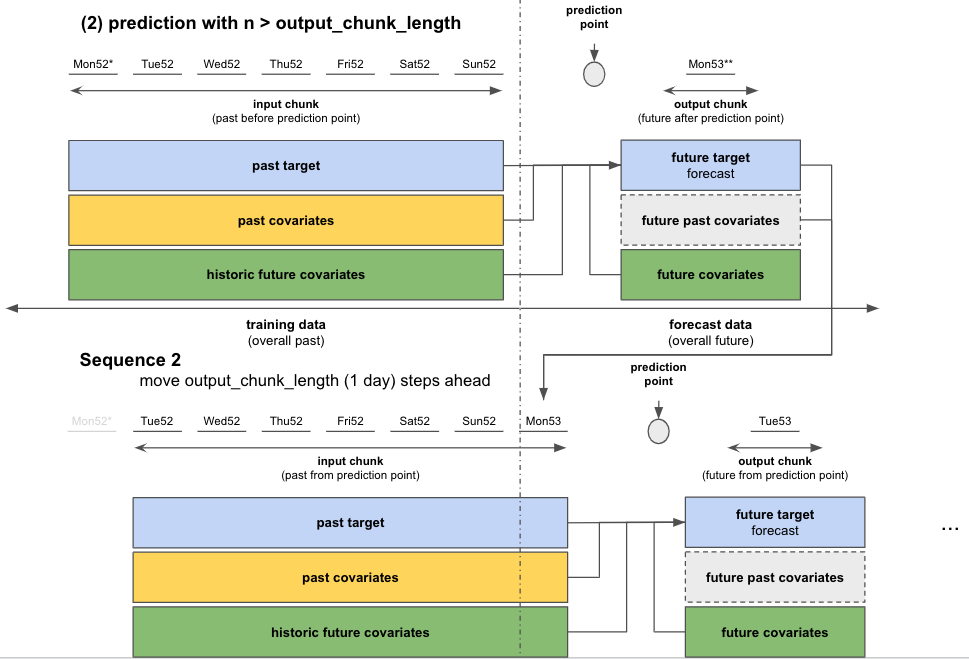

# In-depth look at Torch Forecasting Models
This document was written for darts version 0.15.0.

We assume that you already know about covariates in Darts. If you're new to the topic we recommend you to read our [guide on covariates](https://unit8co.github.io/darts/userguide/covariates.html) first.

## Content of this document

[Section 1](#11-introduction) covers the most important points about Torch Forecasting Models (TFMs):
- How to use TFMs
- Top-level look at chunks
- TFM covariates support
- Time span requirements for target and covariate series

[Section 2](#2-in-depth-look-at-how-input-data-is-used-when-training-and-predicting-with-tfms) gives
an in-depth guide of how input data is used when training and predicting with TFMs.

## 1.1. Introduction
In Darts, **Torch Forecasting Models (TFMs)** are broadly speaking "machine learning based" models, which denote PyTorch-based (deep learning) models.

TFMs train and predict on fixed-length chunks (sub-samples) of your input `target` and `*_covariates` series (if supported). `Target` is the series for which we want to predict the future, `*_covariates` are the past and / or future covariates.

Each chunk contains an input chunk - representing the sample's past - and an output chunk - the sample's future. The sample's prediction point lies at the end of the input chunk. The length of these chunks has to be specified at model creation with parameters `input_chunk_length` and `output_chunk_length` (more on chunks in [section 1.2.](#12-top-level-look-at-training-and-predicting-with-chunks)).

```
# model that looks 7 time steps back (past) and 1 time step ahead (future)
model = SomeTorchForecastingModel(input_chunk_length=7,
                                  output_chunk_length=1,
                                  **model_kwargs)
```

All TFMs can be trained on single or multiple `target` series and, depending on their covariate support (covered in [section 1.3.](#13-torch-forecasting-model-covariates-support)), `past_covariates` and / or `future_covariates`. When using covariates you have to supply one dedicated past and / or future covariates series for each target series.

Optionally, you can use a validation set with dedicated covariates during training. If the covariates have the required time spans, you can use the same for training, validation and prediction. (covered in [section 1.4.](#14-required-target-time-spans-for-training-validation-and-prediction))

```
# fit the model on a single target series with optional past and / or future covariates
model.fit(target,
          past_covariates=past_covariates,
          future_covariates=future_covariates,
          val_series=target_val,  # optionally, use a validation set
          val_past_covariates=past_covariates_val,
          val_future_covariates=future_covariates_val)

# fit the model on multiple target series
model.fit([target, target2, ...],
          past_covariates=[past_covariates, past_covariates2, ...],
          ...
          )
```

You can produce forecasts for any input `target` TimeSeries or for several targets given as a sequence of TimeSeries. This will also work on series that have not been seen during training, as long as each series contains at least `input_chunk_length` time steps.

```
# predict the next n=3 time steps for any input series with `series`
prediction = model.predict(n=3,
                           series=target,
                           past_covariates=past_covariates,
                           future_covariates=future_covariates)
```

If you want to know more about the training and prediction process of our Torch Forecasting Models and how they work with covariates, read on.

## 1.2. Top level look at training and predicting with chunks

In Figure 1 you can see how your data is distributed to the input and output chunks for each sample when calling `fit()` or `predict()`. For this example we look at data with daily frequency. The input chunk extracts values from `target` and optionally from `past_covariates` and / or `future_covariates` that fall into the input chunk time span. These "past" values of `future_covariates` are called "historic future covariates".

The output chunk only takes optional `future_covariates` values that fall into the output chunk time span. The future values of our `past_covariates` - "future past covariates" - are only used to provide the input chunk of upcoming samples with new data.

All this information is used to predict the "future target" - the next `output_chunk_length` points after the end of "past target".



**Figure 1: Top level look at training / predicting on chunks with Torch Forecasting Models**


When calling `predict()` and depending on your forecast horizon `n`, the model can either predict in one go (if `n <= output_chunk_length`), or auto-regressively, by predicting on multiple chunks in the future (if `n > output_chunk_length`). That is the reason why when predicting with `past_covariates` you might have to supply additional "future values of your `past_covariates`".

## 1.3. Torch Forecasting Model Covariates Support

Under the hood, Darts has 5 types of `{X}CovariatesModel` classes implemented to cover different combinations of the covariate types mentioned before:

Class | past covariates | future past covariates | future covariates | historic future covariates
--- | --- | --- | --- | ---
`PastCovariatesModel` | ✅ | ✅ |  |
`FutureCovariatesModel` |  |  | ✅ |
`DualCovariatesModel` |  |  | ✅ | ✅
`MixedCovariatesModel` | ✅ | ✅ | ✅ | ✅
`SplitCovariatesModel` | ✅ | ✅ | ✅ |

**Table 1: Darts' "{X}CovariatesModels" covariate support**

Each Torch Forecasting Model inherits from one `{X}CovariatesModel` (covariate class names are abbreviated by the `X`-part):

TFM | `Past` | `Future` | `Dual` | `Mixed` | `Split` |
--- | --- | --- | --- | --- | ---
`RNNModel` |  |  | ✅ |  |
`BlockRNNModel` | ✅ |  |  |  |
`NBEATSModel` | ✅ |  |  |  |
`TCNModel` | ✅ |  |  |  |
`TransformerModel` | ✅ |  |  |  |
`TFTModel` |  |  |  | ✅ |

**Table 2: Darts' Torch Forecasting Model covariate support**

## 1.4. Required target time spans for training, validation and prediction
The relevant data is extracted automatically by the models, based on the time axes of the series.
You can use the same covariates series for both `fit()` and `predict()` if they meet the requirements below.

**Training** only works if at least one sample with an input and output chunk can be extracted from the data you passed to `fit()`. This applies both to training and validation data. In terms of minimum required time spans, this means:
- `target` series of minimum length `input_chunk_length + output_chunk_length`
- `*_covariates` time span requirements for `fit()` from [covariates guide section 2.3.](https://unit8co.github.io/darts/userguide/covariates.html#id6)

For **prediction** you have to supply the `target` series that you wish to forecast. For any forecast horizon `n` the minimum time span requirements are:
- `target` series of minimum length `input_chunk_length`
- `*_covariates` time span requirements for `predict()` also from from [covariates guide section 2.3.](https://unit8co.github.io/darts/userguide/covariates.html#id6)

Side note: Our `*RNNModels` accept a `training_length` parameter at model creation instead of `output_chunk_length`. Internally the `output_chunk_length` for these models is automatically set to `1`. For training, past `target` must have a minimum length of `training_length + 1` and for prediction, a length of `input_chunk_length`.

## 2. In-depth look at how input data is used when training and predicting with TFMs
## 2.1. Training

Let's have a look at how the models work under the hood.

Let's assume we run an ice-cream shop and we want to predict sales for the next day.
We have one year (365 days) past data of our end-of-day ice-cream sales and of the average measured daily ambient temperature.
We also noticed that our ice-cream sales depend on the day of the week so we want to include this in our model.

- past target: actual past ice-cream sales `ice_cream_sales`
- future target: predict the ice-cream sales for the next day
- past covariates: measured average daily temperatures in the past `temperature`
- future covariates: day of the week for past and future `weekday`

Checking Table 1, a model that would accomodate this kind of covariates would be a
`SplitCovariatesModel` (if we don't use historic values of future covariates), or
`MixedCovariatesModel` (if we do). We choose a `MixedCovariatesModel` - the `TFTModel`.

Imagine that we saw a pattern in our past ice cream sales that repeated week after week.
So we set `input_chunk_length = 7` days to let the model look back an entire week into the past.
The `output_chunk_length` can be set to `1` day to predict the next day.

Now we can create a model and train it! Figure 2 shows you how `TFTModel` will use our data.

```
from darts.models import TFTModel

model = TFTModel(input_chunk_length=7, output_chunk_length=1)
model.fit(series=ice_cream_sales,
          past_covariates=temperature,
          future_covariates=weekday)
```



**Figure 2: Overview of a single sequence from our ice-cream sales example**; Mon1 - Sun1 stand for the first 7 days from our training dataset (week 1 of the year). Mon2 is the Monday of week 2.

When calling `fit()`, the models will build an appropriate `darts.utils.data.TrainingDataset`, which specifies how to slice the data to obtain training samples. If you want to control this slicing yourself, you can instantiate your own `TrainingDataset` and call `model.fit_from_dataset()` instead of `fit()`. By default, most models (though not all) will build *sequential* datasets, which basically means that all sub-slices of length `input_chunk_length + output_chunk_length` in the provided series will be used for training.

So during training, the torch models will go through the training data in sequences (see Figure 3). Using information from the **input chunk** and **output chunk**, the model predicts the future target on the output chunk. The training loss is evaluated between the predicted future target and the actual target value on the output chunk. The model trains itself by minimizing the loss over all sequences.



**Figure 3: Prediction and loss evaluation in a single sequence**

After having completed computations on the first sequence, the model moves to the next one and performs the same training steps. *The starting point of each sequence is selected randomly from the sequential dataset*. Figure 4 shows how this would look like if by pure chance the second sequence started one time step (day) after the first.

This sequence-to-sequence process is repeated until all 365 days were covered.

Side note: Having "long" `target` series can result in a very large number of training sequences / samples. You can set an upper bound for the number of sequences / samples per `target` that the model should be trained on with `fit()`-parameter `max_samples_per_ts`. This will take the most recent sequences for every `target` series (sequences closest to `target` end).

```
# fit only on the 10 "most recent" sequences
model.fit(target, max_samples_per_ts=10)
```



**Figure 4: Sequence-to-sequence: Move to next sequence and repeat training steps**

### 2.1.1. Training with a validation dataset

You can also train your models with a validation dataset:

```
# create train and validation sets
ice_cream_sales_train, ice_cream_sales_val = ice_cream_sales.split_after(training_cutoff)

# train with validation set
model.fit(series=ice_cream_sales_train,
          past_covariates=temperature,
          future_covariates=weekday,
          val_series=ice_cream_sales_val,
          val_past_covariates=temperature,
          val_future_covariates=weekday)
```

If you split your data, you have to define a `training_cutoff` (a date or fraction at which to split the dataset) so that both the train and validation datasets satisfy the minimum length requirements
from [section 1.4.](#14-required-target-time-spans-for-training-validation-and-prediction)

Instead of splitting by time, you can also use another subset of time series as validation set.

The model trains itself the same way as before but additionally evaluates the loss on the validation dataset. If you want to keep track of the best performing model on the validation set, you have to enable checkpoint saving as shown next.

### 2.1.2. Saving and Loading Model States
Per default, the models don't automatically save any checkpoints. If you want to keep track of the best performing model on the validation set and the latest 5 epochs, you have to enable checkpoint saving at model creation:

```
model = SomeTorchForecastingModel(..., model_name='MyModel', save_checkpoints=True)

# checkpoints are saved automatically
model.fit(...)

# load the model state that performed best on validation set
best_model = model.load_from_checkpoint(model_name='MyModel', best=True)
```

You can also save or load manually:
```
model.save_model(model_path)
loaded_model = model.load_model(model_path)
```
/!\ Warning /!\ At this stage of Darts development, we are not (yet) ensuring backward compatibility, so it might not always be possible to load a model saved by an older version of the library.

## 2.2. Forecast/Prediction

After having trained the model, we want to predict the future ice-cream sales for any number of days after our 365 days
training data.

The actual prediction works very similar to how we trained the data on sequences. Depending on the number of days we
want to predict - the forecast horizon `n` - we distinguish between two cases:

- If `n <= output_chunk_length`: we can predict `n` in one go (using one "internal model call")
    - in our example: predict the next day's ice-cream sales (`n = 1`)
- If `n > output_chunk_length`: we must predict `n` by calling the internal model multiple times. Each call outputs `output_chunk_length` prediction points. We go through as many calls as needed until we get to the final `n` prediction points, in an auto-regressive fashion.
    - in our example: predict ice-cream sales for the next 3 days at once (`n = 3`)

  To do this we have to supply additional `past_covariates` for the next `n - output_chunk_length = 2` time steps (days) after the end of our 365 days training data. Unfortunately, we do not have measured `temperture` for the future. But let's assume we have access to temperature forecasts for the next 2 days. We can just append them to `temperature` and the prediction will work!

  ```
  temperature = temperature.concatenate(temperature_forecast, axis=0)
  ```

```
prediction = model.predict(n=n,
                           series=ice_cream_sales_train,
                           past_covariates=temperature,
                           future_covariates=weekday)
```



**Figure 5: Forecast with a single sequence for `n <= output_chunk_length`**




**Figure 6: Auto-regressive forecast for `n > output_chunk_length`**
