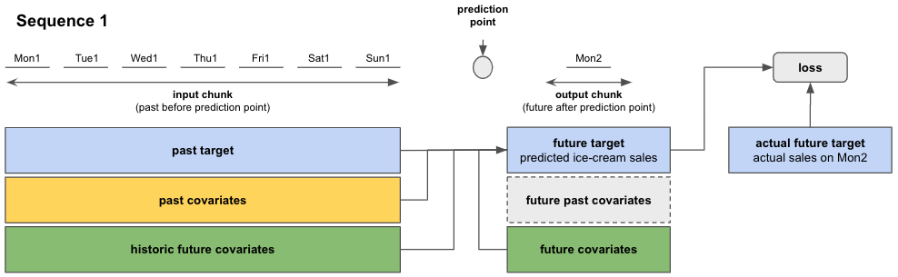

# Darts Covariates

## Summary - TL;DR
In Darts, **covariates** refer to external data that can be used as inputs to models to help improve forecasts.
In the context of forecasting models, the **target** is the series to be forecasted/predicted, and the
covariates themselves are not predicted. We distinguish two kinds of covariates: 

* **past covariates** are (by definition) covariates known only into the past (e.g. measurements)
* **future covariates** are (by definition) covariates known into the future (e.g., weather forecasts)
* **static covariates** are (by definition) covariates constant over time. They are not yet supported in Darts, but we are working on it!

Models in Darts accept `past_covariates` and/or `future_covariates` in their `fit()` and `predict()` methods, depending on their capabilities (some models accept no covariates at all). Both target and covariates must be a `TimeSeries` object. The models will raise an error if covariates were used that are not supported.
```
# create one of Darts' forecasting models
model = SomeForecastingModel(...)

# fitting model with past and future covs
model.fit(target=target, past_covariates=past_covariates_train, future_covariates=future_covariates_train)

# predict the next n=12 steps
model.predict(n=12, ..., past_covariates=past_covariates_pred, future_covariates=future_covariates_pred)
```

If you have several covariate values that you want to use as past (or future) covariates, you have to `stack()` all of them into a single `past_covariates` (or `future_covariates`) object.

```
# stack two TimeSeries
past_covariates = past_covariates.stack(other_past_covariates)
```

Darts' forecasting models expect one past and/or future covariate series per target series. If you use multiple target series with one of Darts' Global Forecasting Models, you must supply the same number of covariates to `fit()`.

```
# fit using multiple (two) target series
model.fit(target=[target, target_2], past_covariates=[past_covariates, past_covariates_2], ...)

# you must give the specific target and covariate series that you want to predict
model.predict(n=12, series=target_2, past_covariates=past_covariates_2, ...)
```

If you train a model using `past_covariates`, you'll have to provide these `past_covariates` also at prediction time to `predict()`. This applies to `future_covariates` too, with a nuance that `future_covariates` have to extend far enough into the future at prediction time (all the way to the forecast horizon `n`). This can be seen in the graph below. `past_covariates` needs to include the same time steps as `target`, and `future_covariates` must include the same time span plus additional `n` forecast horizon time steps. 

*You can use the same `*_covariates` for both training and prediction with Darts` Global Forecasting Models, given that they contain the required time spans.*


-----

#### Figure 1: Top level summary of how forecasting models work with target and covariates for a prediction with forecast horizon n=2
-----

There are some extra nuances that might be good to know. For instance, deep learning models in Darts
can (in general) forecast `output_chunk_length` points at a time. However it is still possible for models 
trained with past covariates to make forecasts for some horizon `n > output_chunk_length` if the `past_covariates`
are known far enough into the future. In such cases, the forecasts are obtained by consuming future values
of the past covariates, and using auto-regression on the target series. If you want to know more details, read on.

-------

## Content of this document

[Section 1](#1-introduction) covers the most important points about covariates in Darts:

- What are covariates in general and in Darts?
- Covariate support for each of Darts' forecasting models
- Requirements for using covariates with Darts' forecasting models

[section 2](#2-darts-xcovariatesmodels) shows an example of how to use covariates with Darts' forecasting models

[Section 3](#3-in-depth-look-at-how-past-and-future-covariates-are-used-in-a-sequential-torch-forecasting-model) gives
an in-depth guide of how covariates are used in Darts' PyTorch-based Forecasting Models.

-----

## 1. Introduction

## 1.1. What are covariates (in Darts)?
Covariates provide additional information/context that can be useful to improve the prediction of the `target` series. The `target` series is the variable we wish to predict the future for. We do not predict the covariates themselves, only use them for prediction of the `target`.

Covariates can hold information about the past (upto and including present time) or future. This is always relative to the prediction point (in time) after which we want to forecast the future.
In Darts, we refer to these two types as `past_covariates` and `future_covariates`. Darts' forecasting models have different support modes for `*_covariates`. Some do not support covariates at all, others support either past or future covariates and some support both (more on that in section 1.2.).

Let's have a look at some examples of past and future covariates:
- `past_covariates`: typically measurements (past data) or temporal attributes 
    -   daily average **measured** temperatures (known only in the past)
    -   day of week, month, year, ...
- `future_covariates`: typically forecasts (future known data) or temporal attributes  
    -   daily average **forecasted** temperatures (known in the future)
    -   day of week, month, year, ...

Temporal attributes are powerful because they are known in advance and can help models capture trends and / or seasonal patterns of the `target` series.

Here's a simple rule-of-thumb to know if your series are past or future covariates:

*If the values are known in advance, they are future covariates (or can be used as past covariates). If they are not, they **must** be past covariates.*

You might imagine cases where you want to train a model supporting only `past_covariates` (such as `TCNModel`, see Table 1). In this case, you could use for instance say, the **forecasted** temperature as a past covariate for the model *even though you also have access to temperature forecasts in the future*. Knowing such "future values of past covariates" can allow you to make forecasts further into the future (for Darts' deep learning models with forecast horizons `n > output_chunk_length`). Similarly most models consuming future covariates can also use "historic values of future covariates".

(Side note: if you don't have future values (e.g. of measured temperatures), nothing prevents you from applying one of Darts' forecasting models to forecast future temperatures, and then use this as `future_covariates`. Darts is not attempting to forecast the covariates for you, as this would introduce an extra "hidden" modeling step, which we think is best left to the users.)

## 1.2. Darts' Forecasting Models And Their Covariate Support
Darts' forecasting models accept optional `past_covariates` and / or `future_covariates` in their `fit()` and `predict()` methods, depending on their capabilities. Table 1 shows the supported covariate types for each model. The models will raise an error if covariates were used that are not supported.

### Local Forecasting Models (LFMs):
LFMs are broadly speaking statisical forecasting models (FEEDBACK REQUIRED). LFMs accept only a single `target` (and covariate) time series. and usually train on the entire series you supplied when calling `fit()` at once. They can also predict in one go for any number of predictions `n` after the end of the training series.

### Global Forecasting Models (GFMs)
GFMs are broadly speaking "machine learning based" models, which denote PyTorch-based (deep learning) models as well as RegressionModels. Global models can all be trained on multiple `target` (and covariate) time series. Different to LFMs, the GFMs train and predict on fixed-length sub-samples (chunks) of the input data.

----

Model | Past Covariates | Future Covariates
--- | :---: | :---:
**Local Forecasting Models (LFMs)** | |
`ExponentialSmoothing` |  |  |  |
`Theta` and `FourTheta` |   |  |  |
`FFT` |  |  |  |
`ARIMA` |  | ✅ |  |
`VARIMA` |  | ✅ |  |
`AutoARIMA` |  | ✅ |  |
`Prophet` |  | ✅ |  |
**Global Forecasting Models (GFMs)** | | |
`RegressionModel`* | ✅ | ✅ |  |
`RNNModel`** |  | ✅ |  |
`BlockRNNModel`*** | ✅ |  |  |
`NBEATSModel` | ✅ |   |   |
`TCNModel` | ✅ |  |   |
`TransformerModel` | ✅ |   |   |
`TFT` | ✅ | ✅ |  |

#### Table 1: Darts' forecasting models and their covariate support


`*` `RegressionModel` including `RandomForest`, `LinearRegressionModel` and `LightGBMModel`. `RegressionModel` is a
special kind of GFM which can use arbitrary lags on covariates (past and/or future) 
and past targets to do predictions.

`**` `RNNModel` including `LSTM` and `GRU`; equivalent to DeepAR in its probabilistic version

`***` `BlockRNNModel` including `LSTM` and `GRU`

----

## 1.2.1. Quick guide on how to use covariates with Darts' forecasting models
It is very simple to use covariates with Darts' forecasting models. There are just some requirements they have to fulfill. 

Just like the `target` series, each of your past and / or future covariates series must be a `TimeSeries` object. When you train your model with `fit()` using past and /or future covariates, you have to supply the same types of covariates to `predict()`. Depending on the choice of your model and how long your forecast horizon `n` is, there might be different time span requirements for your covariates. You can find these requirements in the next section 1.2. 

*With GFMs you can even use the same `*_covariates` for fitting and prediction if they have sufficient time spans (see in code block 3).*

```
# create one of Darts' forecasting model
model = SomeForecastingModel(...)
# fit the model
model.fit(target, past_covariates=past_covariates_train, future_covariates=future_covariates_train)
# make a prediction
pred = model.predict(n=1, ..., past_covariates=past_covariates_pred, future_covariates=future_covariates_pred)
```

To use multiple past and / or future covariates with your `target`, you have to stack them all together into a single dedicated `TimeSeries`:

```
# stacked time series
past_covariates = past_covariates.stack(past_covariates2)
```
Whenever you use multiple `target` series for training with GFMs, you have to supply the same number of covariates to `fit()`. At prediction time you have to specify which `target` series you want to predict and supply the corresponding covariates:

```
# multiple time series
all_targets = [target1, target2, ...]
all_past_covariates = [past_covariates1, past_covariates2, ...]

# create a GFM model, train and predict
model = NBEATSModel(input_chunk_length=1, output_chunk_length=1)
model.fit(all_targets, past_covariates=all_past_covarites)
pred = model.predict(n=1, series=all_targets[0], past_covariates=all_past_covariates[0])
```

## 1.2.2. Covariate time span requirements for Local and Global Forecasting Models

There are differences in how Darts' "Local" and "Global" Forecasting Models perform training and prediction. Specifically, how they extract/work with the data supplied during fit() and predict().

Depending on the model you use and how long your forecast horizon `n` is, there might be different time span requirements for your covariates.

## Local Forecasting Models (LFMs):
LFMs usually train on the entire `target` and `future_covariates` (if supported) series you supplied when calling `fit()` at once. They can also predict in one go for forecast horizon `n` after the end of the `target`.

- `fit()` with `future_covariates`: **identical** time span as `target`
- `predict()` with `future_covariates`: **only** the next `n` time steps after the end of `target`

## Global Forecasting Models (GFMs):
GFMs train and predict on fixed-length chunks (sub-samples) of the `target` and `*_covariates` (if supported) series. Each chunk contains an input chunk - resembling the sample's past - and an output chunk - the sample's future. The length of these chunks has to be specified at model creation with parameters `input_chunk_length` and `output_chunk_length`.

Depending on your forecast horizon `n`, the model can either predict in one go, or auto-regressively, by predicting on multiple chunks in the future. That is the reason why when predicting with `past_covariates` you have to supply additional "future values of your `past_covariates`".

- `fit()` with `*_covariates`: **at least** the same time span as `target`
- `predict()` with `past_covariates`:
  - with `n <= output_chunk_length`: **at least** the same time span as `target`
  - with `n > output_chunk_length`: **at least** the same time span as `target` plus the next `n - output_chunk_length` time steps
- `predict()` with `future_covariates`:
  - with `n <= output_chunk_length`: **at least** the same time span as `target` plus the next `output_chunk_length` time steps
  - with `n > output_chunk_length`: **at least** the same time span as `target` plus the next `n` time steps


## 3. In-depth look at how past and future covariates are used in a Global Forecasting Model

## 3.1. Training

For simplicity, we consider the same ice-cream sales forecasting example from before,
with the exception that we now replace past measured rainfalls with some past measured
temperature:

- past target: actual past ice-cream sales `past_ice_cream_sales`
- future target: predict the ice-cream sales for the next day
- past covariates: measured average daily temperatures in the past `measured_past_temperature`
- future covariates: estimated average temperature for the next day `estimated_future_temperature`

Checking Table 1, a model that would accomodate this kind of covariates would be a
`SplitCovariatesModel` (if we don't use historic values of future covariates), or
`MixedCovariatesModel` (if we do).

Let's assume we have one year (365 days) of daily ice-cream sales and measured/estimated daily average temperature data
available for training.

We can create a model and train it with:

```
model = SomeDartsGlobalModel(input_chunk_length=7, output_chunk_length=1)
model.fit(series=past_ice_cream_sales,
          past_covariates=measured_past_temperature, 
          future_covariates=estimated_future_temperature)
```

When calling `fit()`, the models will build an appropriate `darts.utils.data.TrainingDataset`,
which specifies how to slice the data to obtain training samples. If you want to control this slicing
yourself, you can instantiate your own `TrainingDataset` and call `model.fit_from_dataset()` instead
of `fit()`. By default, most models (though not all) will build *sequential* datasets, which basically
means that all sub-slices of length `input_chunk_length + output_chunk_length` in the provided series
will be used for training. 

So during training, the torch models will go through the training data in sequences 
with **input chucks** of length `input_chunk_length` and **output chunks** of 
length `output_chunk_length` (see Figure 4 below).

For this example we used:

- `input_chunk_length = 7` days (use daily data from the past week)
- `output_chunk_length = 1` day (predict the next day)

The **prediction point** for each sequence separates input chunk from output chunk.

- the input chunk represents the past relative to the sequence's prediction point. In our case, the input chunk of each
  sequence contains values of the last 7 days from past targets and past covariates.
- the output chunk represents the future relative to the sequence's prediction point. In our example, the output chunk
  of each sequence contains the value of the next day from future covariates.

Mon1 - Sun1 stand for the first 7 days from our training dataset (week 1 of the year). Mon2 is the Monday of week 2.

Note that historic future covariates and future past covariates are greyed out in Figure 4. Historic future covariates
are not supported by `SplitCovariatesModel`. The future past covariates in the training process are automatically
extracted from the past covariates (`measured_past_temperature`) supplied to `model.fit()`. They are internally used
to load the next past covariates for coming sequences.


**Figure 4: Overview of a single sequence from our ice-cream sales example**

Using information from the **input chunk** (past target and past covariates) and **output chunk**
(future covariates), the model predicts the future target on the output chunk (see Figure 5 below).

The loss is evaluated between the predicted future target and the actual target value on the output chunk. The model
trains itself by minimizing the loss over all sequences.


**Figure 5: Prediction and loss evaluation in a single sequence**

After having completed computations on the first sequence, the model moves to the next sequence, which, in the
case of sequential models, starts one time step later than the previous sequence. The process is repeated for 
all coming sequences until the 365 days are covered.


**Figure 6: Move to next sequence and repeat**

### 3.1.1. Requirements for training with past and future covariates

Training only works if at least one sequence with an input and output chunk can be extracted from the data you passed
to `fit()`. In terms of minimum lengths, this means:

- past target of minimum length `input_chunk_length + output_chunk_length`
    - in our example that is a minimum of 8 days: first 7 days for the input chunk 8th day for the output chunk
- past covariates of minimum length `past_target_length - output_chunk_length`
- future covariates (in our example) of minimum length: `past_target_length` (for `Dual` and `Mixed` models) or
  `past_target_length - input_chunk_length`.

A good thing in Darts is that you can supply covariates of any length larger than the minimum requirement. Meaning that
the relevant covariate time sections will be extracted automatically by the datasets, based on the time axes of the
series.

### 3.1.2. Training with a validation dataset

You can train your models with a validation dataset with:

```
# create train and validation sets
past_ice_cream_sales_train, past_ice_cream_sales_val = past_ice_cream_sales.split_after(training_cutoff)

# train with validation set
model.fit(series=past_ice_cream_sales_train,
          past_covariates=measured_past_temperature, 
          future_covariates=estimated_future_temperature,
          val_series=past_ice_cream_sales_val,
          val_past_covariates=measured_past_temperature,
          val_future_covariates=estimated_future_temperature)
```

You have to define a `training_cutoff` (a date or fraction at which to split the dataset) so that both the train and
validation datasets satisfy the minimum length requirements
from [section 3.1.1.](#311-requirements-for-training-with-past-and-future-covariates)

Instead of splitting by time, you can also reserver another subset of time series as validation set.

The model trains itself the same way as before but additionally evaluates the loss on the validation dataset and keeps
track of the best performing model using this validation loss.


## 3.2. Forecast/Prediction

After having trained the model, we want to predict the future ice-cream sales for any number of days after our 365 days
training data.

The actual prediction works very similar to how we trained the data on sequences. Depending on the number of days we
want to predict - the forecast horizon `n` - we distinguish between two cases:

- If `n <= output_chunk_length`: we can predict `n` in one go (using one "internal model call")
    - example: we only want to predict the next day's ice-cream sales (`n = 1`)
- If `n > output_chunk_length`: we must predict `n` by calling the internal model multiple times. Each call
  outputs `output_chunk_length` prediction points. We go through as many calls as needed until we get to the final `n`
  prediction points, in an auto-regressive fashion.
    - example: we want to predict ice-cream sales for the next 3 days at once (`n = 3`)

A few notes on which data must be supplied to do predictions:

- `series` is the `TimeSeries` (or `Sequence` of `TimeSeries`) to forecast. When models are trained on a single series,
  omitting the `series` parameter will produce forecasts for the (single) training series.
- `past_covariates` with sufficient time span (see Sect. 2.1.1)
- `future_covariates` with sufficient time span (see Sect. 2.1.1)


**Figure 7: forecast with a single sequence for n <= `output_chunk_length`**


As an example, we could try to predict ice-cream sales for the next 3 days with:
```
ice_cream_sales_next_days = model.predict(n=3,
                                          past_covariates=measured_tempereature_including_for_next_two_days,
                                          future_covariates=estimated_temperature_next_three_days)
```

But it is impossible to have *measured* data from the future! True, and that is the reason why this particular
forecast case cannot work with the given `n`, `output_chunk_length` and past covariates.

Fortunately, there is a way how you could still get forecasts for `n = 3`:

- set `output_chunk_length` at model creation to be larger than or equal to `n`, so that we do not have to supply **
  measured future** past covariates.
- keep in mind that all minimum time-span requirements
  from [section 3.1.1.](#311-requirements-for-training-with-past-and-future-covariates)
  and [section 3.2.1.](#321-requirements-for-prediction-with-past-and-future-covariates) are satifisfied for the
  new `output_chunk_length`


**Figure 8: forecast with multiple sequences and `n > output_chunk_length`**

### When can we predict with `n > output_chunk_length`?

It is possible to predict with forecast horizons `n` longer than your `output_chunk_length` when all of the following
conditions are met:

- if future covariates are used: must be supplied for `n` points in the future
- if past covariates are used:
    - past covariates must be known in the future (e.g. day of the week, hour of the day, week of the year, year, ...)
    - must be supplied for `n - output_chunk_length` points in the future


Requirements for covariates with forecasting models

- Just like the `target` series, the `*_covariates` must be a `TimeSeries` object
- When using `fit()` with `*_covariates`, you must pass the same types of covariates to `predict()`. You can use the same `*_covariates` for fitting and prediction if they have sufficient time spans.
  ```
  # LFM
  model_lfm = Prophet()
  model_lfm.fit(target, future_covariates=future_covariates)
  model_lfm.predict(n=1, future_covariates=future_covariates)

  # GFM - regression models
  model_reg = RegressionModel(lags=None,
                              lags_past_covariates=[-5, -4, -3, -2, -1], 
                              lags_future_covariates=[-4, -3, -2, -1, 0])
  model_reg.fit(target, past_covariates=past_covariates, future_covariates=future_covariates)
  model_reg.predict(n=1, series=target, past_covariates=past_covariates, future_covariates=future_covariates)
  
  # GFM - PyTorch-based models
  model_gfm = TCNModel(input_chunk_length=1, output_chunk_length=1)
  model_gfm.fit(target, past_covariates=past_covariates)
  model_gfm.predict(n=1, series=target, past_covariates=past_covariates)
  ```
- To use multiple past and / or future covariates with your `target`, you have to stack them all together into a single dedicated `TimeSeries`:

  ```
  past_covariates = past_covariates.stack(past_covariates2)
  ```

- Whenenver you use multiple target series (only possible with Global Forecasting Models) for training, you have to supply the same number of covariates. 

  ```
  # fit and predict with mutltiple time series
  all_targets = [target1, target2, ...]
  all_past_covariates = [past_covariates1, past_covariates2, ...]

  # take any GFM
  model_gfm.fit(all_targets, past_covariates=all_past_covariates)
  model.predict(n=1, series=all_targets[0], past_covariates=all_past_covariates[0])
  ```


- Just like the `target` series, the `*_covariates` must be a `TimeSeries` object
- When using `fit()` with `*_covariates`, you must supply the same types of covariates to `predict()`. 
- To use multiple past and / or future covariates with your `target`, you have to stack them all together into a single dedicated `TimeSeries`:
  ```
  # stacked time series
  past_covariates = past_covariates.stack(past_covariates2)
  ```
- Whenever you use multiple `target` series for training with GFMs, you have to supply the same number of covariates to `fit()`. 
  ```
  # multiple time series
  all_targets = [target1, target2, ...]
  all_past_covariates = [past_covariates1, past_covariates2, ...]
  ```
- The time spans that your covariates cover must meet some model-specific requirements that you can find in section 1.3. With GFMs you can use the same `*_covariates` for fitting and prediction if they have sufficient time spans.