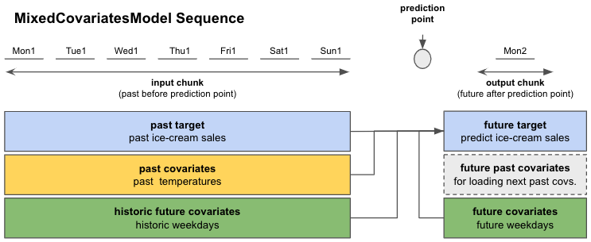

# In-depth look at Global Forecasting Model
This document assumes that you already know about covariates in Darts. If you're new to the topic we recommend you to read darts/guides/covariates.md

## Summary - TL;DR
In Darts, **Global Forecasting Models (GFMs)** are broadly speaking "machine learning based" models, which denote PyTorch-based (deep learning) models as well as RegressionModels.

GFMs train and predict on fixed-length chunks (sub-samples) extracted from your input data. Each chunk contains an input chunk - resembling the sample's past - and an output chunk - the sample's future. The length of these chunks has to be specified at model creation with parameters `input_chunk_length` and `output_chunk_length`.

```
# model that looks 7 time steps back (past) and 1 time step ahead (future)
model = SomeGlobalForecastingModel(input_chunk_length=7, output_chunk_length=1, **model_kwargs)
```

All GFMs can be trained on single or multiple `target` series and, depending on their covariate support, `past_covariates` and / or `future_covariates`.

```
# fit the model on a single target series with optional past and / or future covariates
model.fit(target, past_covariates=past_covariates, future_covariates=future_covariates)
```

You can produce forecasts for any input TimeSeries (also unobserved targets) as long as it contains `input_chunk_length` time steps.

```
# predict the next n=3 time steps for any input series with `series`
prediction = model.predict(n=3, series=target, past_covariates=past_covariates, future_covariates=future_covariates)
```

## Content of this document

[Section 1](#1-global-forecasting-models) covers the most important points about Global Forecasting Models:
- how they work on a top-level
- how you can use them
- time span requirements for target and covariate series

[Section 2](#2-in-depth-look-at-how-past-and-future-covariates-are-used-in-a-global-forecasting-model) gives
an in-depth guide of how covariates are used in Darts' PyTorch-based Forecasting Models.

## 1. Global Forecasting Models
## 1.1. Introduction
GFMs are broadly speaking "machine learning based" models, which denote PyTorch-based (deep learning) models as well as RegressionModels.

GFMs train and predict on fixed-length chunks (sub-samples) of the `target` and `*_covariates` series (if supported). `Target` is the series for which we want to predict the future, `*_covariates` are the past and / or future covariates (explanatory variables) that can help models improve forecasts. 

Each chunk contains an input chunk - resembling the sample's past - and an output chunk - the sample's future. The sample's prediction point lies at the end of the input chunk. The length of these chunks has to be specified at model creation with parameters `input_chunk_length` and `output_chunk_length`.

```
# model that looks 7 time steps back (past) and 1 time step ahead (future)
model = SomeGlobalForecastingModel(input_chunk_length=7, output_chunk_length=1)
```

Depending on their capabilities, GFMs accept past and / or future covariates as optional parameters `past_covariates` and `future_covariates` in `fit()` and `predict()`. You can find the covariate support for each GFM in section 2. 

*The same covariates can be used for training and prediction if they have the required time spans (explained in darts/guides/covariates.md)*

```
# fit the model with optional past and / or future covariates
model.fit(target, past_covariates=past_covariates, future_covariates=future_covariates)

# predict the next n=3 time steps
prediction = model.predict(n=3, series=target, past_covariates=past_covariates, future_covariates=future_covariates)
```

In figure 0 you can see how your data is distributed to the input and output chunks for each sample. For this example we use data with a daily frequency. The input chunk extracts values from `target` and optionally from `past_covariates` and / or `future_covariates` that fall into the input chunk time span. These "past" values of `future_covariates` are called "historic future covariates". 

The output chunk only takes optional `future_covariates` values that fall into the output chunk time span. The future values of our `past_covariates` - "future past covariates" - are only used to provide the input chunk of upcoming samples with new data. 

All this information is used to predict the "future target" - the next `output_chunk_length` points after the end of "past target".


Depending on your forecast horizon `n`, the model can either predict in one go (if `n <= output_chunk_length`), or auto-regressively, by predicting on multiple chunks in the future (if `n > output_chunk_length`). That is the reason why when predicting with `past_covariates` you might have to supply additional "future values of your `past_covariates`".


Global models can all be trained on single or multiple `target` (and covariate) time series. For each target series you have to provide a dedicated past and / or future covariates series. At prediction time, you have to specify the series that you want to produce the forecast for along with the corresponding `*_covariates`.

```
# using multiple targets (only past_covariates shown for simplicity)
target_all = [target1, target2, ...]
past_covariates_all = [past_covariates1, past_covariates2, ...]

model.fit(target_all, past_covariates=past_covariates_all)

# supply the series that you want to forecast
prediction = model.predict(n=10, series=target_all[0], past_covariates=past_covariates_all[0])
```


## 1.2. Global Forecasting Model Covariates Support

Under the hood, Darts has 5 types of `{X}CovariateModel` classes implemented to cover different combinations of the covariate types mentioned before:

Class | past covariates | future past covariates | future covariates | historic future covariates
--- | :---: | :---: | :---: | :---:
`PastCovariatesModel` | ✅ | ✅ |  |  |
`FutureCovariatesModel` |  |  | ✅ |  |
`DualCovariatesModel` |  |  | ✅ | ✅ |
`MixedCovariatesModel` | ✅ | ✅ | ✅ | ✅ |
`SplitCovariatesModel` | ✅ | ✅ | ✅ |  |

**Table 1: Darts' `{X}CovariatesModels` covariate support**

Each Global Forecasting Model inherits from one `{X}CovariatesModel` (covariate class names are abbreviated by the `X`-part):

GFM | `Past` | `Future` | `Dual` | `Mixed` | `Split` |
--- | :---: | :---: | :---: | :---: | :---:
`RegressionModel` |  |  |  | ✅ |  |
`RNNModel` |  |  | ✅ |  |  |
`BlockRNNModel` | ✅ |  |  |  |  |
`NBEATSModel` | ✅ |  |  |  |  |
`TCNModel` | ✅ |  |  |  |  |
`TransformerModel` | ✅ |  |  |  |  |
`TFT` |  |  |  | ✅ |  |

**Table 2: Darts' Global Forecasting Model covariate support**

## 1.3. Required target time spans for training and prediction
The relevant data is extracted automatically by the models, based on the time axes of the series.
You can use the same covariates series for both `fit()` and `predict()` if they meet the requirements below.

Training only works if at least one sample with an input and output chunk can be extracted from the data you passed to `fit()`. In terms of minimum required time spans, this means:
- past `target` of minimum length `input_chunk_length + output_chunk_length`
- `*_covariates` time span requirements for `fit()` from darts/guides/covariates.md section 1.2.2.

For prediction you have to supply the `target` series that you wish to forecast. For any forecast horizon `n` the minimum time span requirements are:
- `target` of minimum length `input_chunk_length`
- `*_covariates` time span requirements for `predict()` from darts/guides/covariates.md section 1.2.2.

## 2. In-depth look at how past and future covariates are used in a Global Forecasting Model
## 2.1. Training

For simplicity, we consider the same ice-cream sales forecasting example from before,
with the exception that we now replace past measured rainfalls with some past measured
temperature:

- past target: actual past ice-cream sales `past_ice_cream_sales`
- future target: predict the ice-cream sales for the next day
- past covariates: measured average daily temperatures in the past `measured_past_temperature`
- future covariates: estimated average temperature for the next day `estimated_future_temperature`

Checking Table 1, a model that would accomodate this kind of covariates would be a
`SplitCovariatesModel` (if we don't use historic values of future covariates), or
`MixedCovariatesModel` (if we do).

Let's assume we have one year (365 days) of daily ice-cream sales and measured/estimated daily average temperature data
available for training.

We can create a model and train it with:

```
model = SomeDartsGlobalModel(input_chunk_length=7, output_chunk_length=1)
model.fit(series=past_ice_cream_sales,
          past_covariates=measured_past_temperature, 
          future_covariates=estimated_future_temperature)
```

When calling `fit()`, the models will build an appropriate `darts.utils.data.TrainingDataset`,
which specifies how to slice the data to obtain training samples. If you want to control this slicing
yourself, you can instantiate your own `TrainingDataset` and call `model.fit_from_dataset()` instead
of `fit()`. By default, most models (though not all) will build *sequential* datasets, which basically
means that all sub-slices of length `input_chunk_length + output_chunk_length` in the provided series
will be used for training. 

So during training, the torch models will go through the training data in sequences 
with **input chucks** of length `input_chunk_length` and **output chunks** of 
length `output_chunk_length` (see Figure 4 below).

For this example we used:

- `input_chunk_length = 7` days (use daily data from the past week)
- `output_chunk_length = 1` day (predict the next day)

The **prediction point** for each sample separates input chunk from output chunk.

Mon1 - Sun1 stand for the first 7 days from our training dataset (week 1 of the year). Mon2 is the Monday of week 2.



**Figure 4: Overview of a single sequence from our ice-cream sales example**

Using information from the **input chunk** and **output chunk**, the model predicts the future target on the output chunk (see Figure 5 below).

The training loss is evaluated between the predicted future target and the actual target value on the output chunk. The model
trains itself by minimizing the loss over all sequences.


**Figure 5: Prediction and loss evaluation in a single sequence**

After having completed computations on the first sequence, the model moves to the next sequence, which, in the
case of sequential models, starts one time step later than the previous sequence. This process is repeated until all 365 days were covered.


**Figure 6: Move to next sequence and repeat**

### 2.1.1. Training with a validation dataset

You can also train your models with a validation dataset:

```
# create train and validation sets
past_ice_cream_sales_train, past_ice_cream_sales_val = past_ice_cream_sales.split_after(training_cutoff)

# train with validation set
model.fit(series=past_ice_cream_sales_train,
          past_covariates=measured_past_temperature, 
          future_covariates=estimated_future_temperature,
          val_series=past_ice_cream_sales_val,
          val_past_covariates=measured_past_temperature,
          val_future_covariates=estimated_future_temperature)
```

If you split your data, you have to define a `training_cutoff` (a date or fraction at which to split the dataset) so that both the train and validation datasets satisfy the minimum length requirements
from [section 3.1.1.](#311-requirements-for-training-with-past-and-future-covariates)

Instead of splitting by time, you can also use another subset of time series as validation set.

The model trains itself the same way as before but additionally evaluates the loss on the validation dataset. If you want to keep track of the best performing model on the validation set, you have to enable checkpoint saving as shown next.

## 2.1.2. Saving and Loading Model States
Per default, the models don't automatically save any checkpoints. If you want to keep track of the best performing model on the validation set and the latest 5 epochs, you have to enable checkpoint saving at model creation:

```
model = SomeTorchForecastingModel(..., model_name='MyModel', save_checkpoints=True)

# checkpoints are saved automatically
model.fit(...)

# load the model state that performed best on validation set 
best_model = model.load_from_checkpoint(model_name='MyModel', best=True)
```

You can also save or load manually:
```
model.save_model(model_path)
loaded_model = model.load_model(model_path)
```


## 2.2. Forecast/Prediction

After having trained the model, we want to predict the future ice-cream sales for any number of days after our 365 days
training data.

The actual prediction works very similar to how we trained the data on sequences. Depending on the number of days we
want to predict - the forecast horizon `n` - we distinguish between two cases:

- If `n <= output_chunk_length`: we can predict `n` in one go (using one "internal model call")
    - example: predict the next day's ice-cream sales (`n = 1`)
- If `n > output_chunk_length`: we must predict `n` by calling the internal model multiple times. Each call outputs `output_chunk_length` prediction points. We go through as many calls as needed until we get to the final `n` prediction points, in an auto-regressive fashion.
    - example: predict ice-cream sales for the next 3 days at once (`n = 3`)

```
prediction = model.predict(n=n, 
                           series=past_ice_cream_sales_train, 
                           past_covariates=measured_past_temperature,
                           future_covariates=estimated_future_temperature)
```


**Figure 7: forecast with a single sequence for `n <= output_chunk_length`**


**Figure 8: auto-regressive forecast for `n > output_chunk_length`**